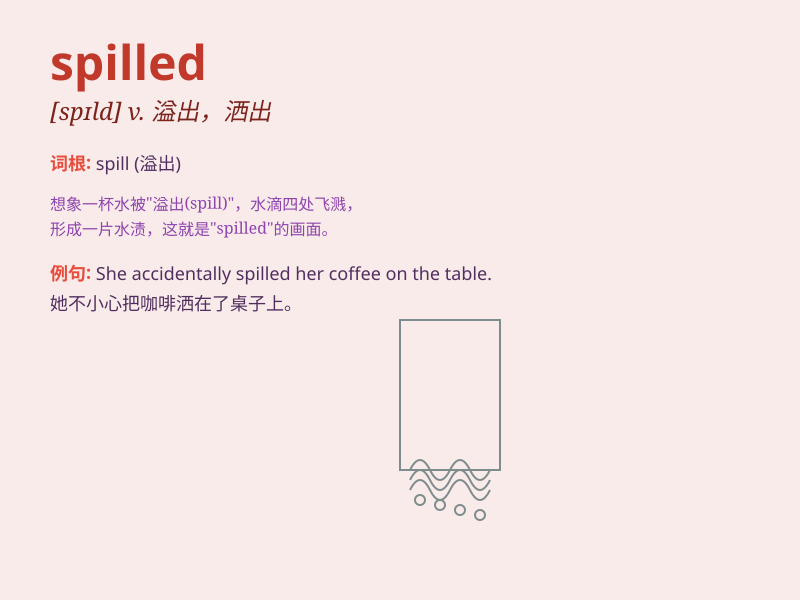

## spilled

**英音:** _[spɪld]_ **美音:** _[spɪld]_

**译义:** *v. 溢出，洒出（spill
的过去式和过去分词）；使流出，使洒落；使跌落，使摔下；使（血）流出，使（泪）流下；（非正式）放弃，离开（工作、住处等）；（非正式）泄露（秘密）；（非正式）（尤指在赌博中）输掉（钱）*

### 短语

+ **spilled milk:** _不可挽回的损失；无法弥补的错误_

+ **spilled water:** _洒出的水_

+ **spilled ink:** _泼出的墨水_

+ **spilled coffee:** _洒出的咖啡_

+ **spilled secrets:** _泄露的秘密_

### 例句

#### 例句1

> **The coffee spilled all over the table.**

**中文翻译:** 咖啡洒得满桌子都是。

**单词释义:** 洒出，溢出

#### 例句2

> **She spilled the beans about the surprise party.**

**中文翻译:** 她泄露了惊喜派对的秘密。

**单词释义:** 泄露

#### 例句3

> **The ink spilled from the pen and ruined the paper.**

**中文翻译:** 墨水从钢笔里溢出，把纸弄脏了。

**单词释义:** 溢出

### 背诵小故事

> One day, I was carrying a cup of coffee. Suddenly, I tripped and the
coffee spilled all over the floor. It was a messy situation! The
word\'spilled\' means liquid flowing out of a container accidentally.

**有一天，我正端着一杯咖啡。突然，我绊了一跤，咖啡全都洒在了地上。真是一片狼藉！单词"spilled"意思是液体意外地从容器中流出。**

### 图义

