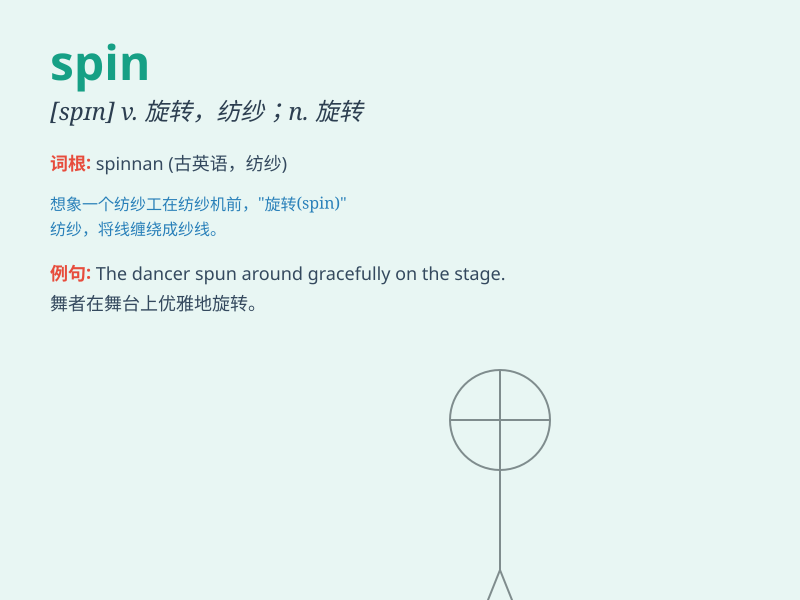

## spin

**英音:** _[spɪn]_ **美音:** _[spɪn]_

**译义:** *v.旋转,纺,纺纱n.旋转*

### 短语

+ **spin around:** _旋转；转身_

+ **spin off:** _（从现有公司中）剥离出，独立出来_

+ **spin out:** _拖延；使（某事）持续很长时间_

+ **spin a yarn:** _讲故事；胡编乱造_

+ **spin doctor:**
_（为政治家或名人等）进行公关宣传、形象设计的人_

### 例句

#### 例句1

> **The spider spins a web to catch insects.**

**中文翻译:** 蜘蛛结网来捕捉昆虫。

**单词释义:** 织（网）

#### 例句2

> **The car spun out of control on the icy road.**

**中文翻译:** 汽车在结冰的路面上失控打滑。

**单词释义:** （使）旋转；（使）打转

#### 例句3

> **She sat there, spinning the wool into thread.**

**中文翻译:** 她坐在那里，把羊毛纺成线。

**单词释义:** 纺（线）

### 背诵小故事

> A little spider was trying to spin a web. It worked hard, moving
around and using its silk. Finally, it succeeded and the beautiful web
was ready. \'Spin\' means to turn quickly or make something by twisting.

**一只小蜘蛛正在努力织网。它努力工作，四处移动并用它的丝。最后，它成功了，漂亮的网织好了。\'spin\'意思是快速转动或通过扭转来制造某物。**

### 图义

