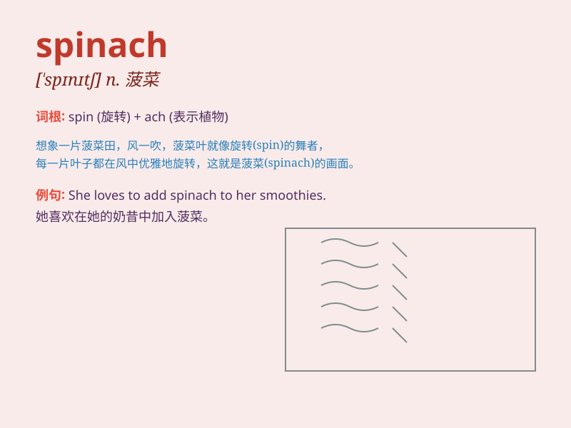

## spinach

**英音:** _[\'spɪnɪdʒ; -ɪtʃ]_ **美音:** _[\'spɪnɪtʃ]_

**译义:** *n.菠菜,胡说八道*

### 短语

+ **spinach salad:** _菠菜沙拉_

+ **cooked spinach:** _熟菠菜_

+ **fresh spinach:** _新鲜菠菜_

+ **spinach soup:** _菠菜汤_

+ **spinach leaves:** _菠菜叶_

### 例句

#### 例句1

> **I don\'t like spinach because of its taste.**

**中文翻译:** 我不喜欢菠菜，因为它的味道。

**单词释义:** 菠菜

#### 例句2

> **She bought some fresh spinach from the market.**

**中文翻译:** 她从市场上买了一些新鲜的菠菜。

**单词释义:** 菠菜

#### 例句3

> **The chef added spinach to the salad to make it more
nutritious.**

**中文翻译:** 厨师在沙拉中添加了菠菜，使其营养更加丰富。

**单词释义:** 菠菜

### 背诵小故事

> A little rabbit was very weak. A wise owl suggested it eat spinach.
The rabbit did and became strong. It could now jump and play happily.
Spinach is a kind of healthy food.

**一只小兔子非常虚弱。一只聪明的猫头鹰建议它吃菠菜。兔子照做了，然后变得强壮。它现在可以快乐地蹦跳玩耍。菠菜是一种健康的食物。**

### 图义

