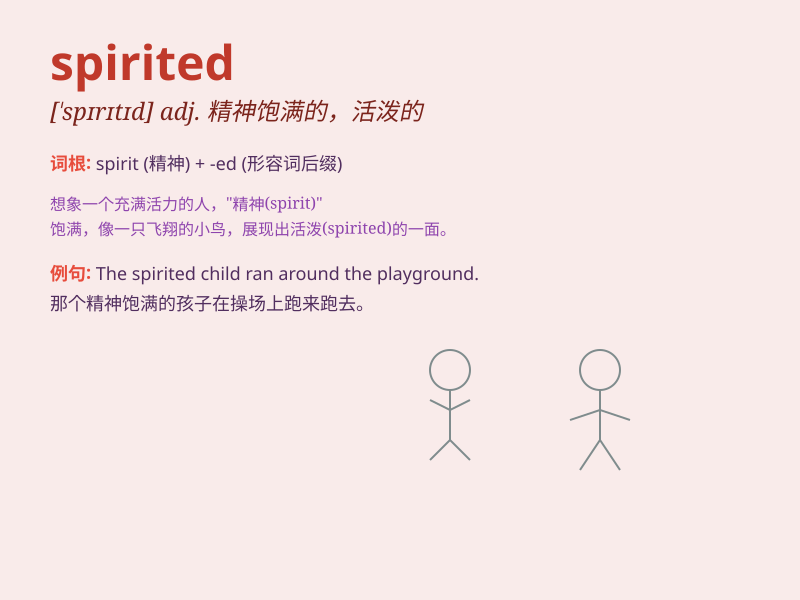

## spirited

**英音:** _[\'spɪrɪtɪd]_ **美音:** _[\'spɪrɪtɪd]_

**译义:** *adj.英勇的*

### 短语

+ **spirited away:** _（被）神隐；（被）带走_

+ **spirited debate:** _热烈的辩论_

+ **spirited performance:** _充满活力的表演_

+ **spirited resistance:** _顽强的抵抗_

+ **spirited horse:** _有精神的马_

### 例句

#### 例句1

> **The children had a spirited game of tag in the park.**

**中文翻译:** 孩子们在公园里进行了一场激烈的捉人游戏。

**单词释义:** 充满活力的；活泼的

#### 例句2

> **She gave a spirited defense of her beliefs.**

**中文翻译:** 她为自己的信仰进行了激烈的辩护。

**单词释义:** 勇敢的；坚决的

#### 例句3

> **The horse was spirited and difficult to control.**

**中文翻译:** 这匹马很活泼，很难控制。

**单词释义:** 烈性的；易激动的

### 背诵小故事

> A little girl was lost in a forest. But she was spirited and not
afraid. She kept looking for the way out and finally found it. Her
spirited attitude helped her overcome difficulties.

**一个小女孩在森林里迷路了。但她精神饱满且毫不畏惧。她一直寻找出路，最终找到了。她这种有精神的态度帮助她克服了困难。**

### 图义

