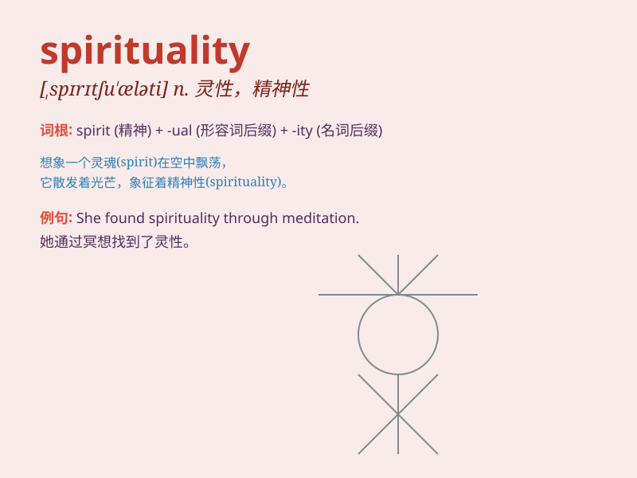

## spirituality

**英音:** _[,spɪrɪtjʊ\'ælətɪ]_ **美音:**
_[,spɪrɪtʃu\'æləti]_

**译义:** *n.精神性,灵性*

### 短语

+ **spiritual awakening:** _精神觉醒_

+ **spiritual growth:** _精神成长_

+ **spiritual practice:** _精神修行_

+ **spiritual journey:** _精神之旅_

+ **spiritual wisdom:** _精神智慧_

### 例句

#### 例句1

> **She is deeply involved in the study of spirituality and its
impact on human well-being.**

**中文翻译:** 她深入研究灵性及其对人类福祉的影响。

**单词释义:** 灵性；精神性

#### 例句2

> **The book explores various aspects of spirituality from different
religious perspectives.**

**中文翻译:** 这本书从不同的宗教角度探讨了灵性的各个方面。

**单词释义:** 灵性

#### 例句3

> **His music is filled with a sense of spirituality that touches the
hearts of many.**

**中文翻译:** 他的音乐充满了灵性，触动了许多人的心。

**单词释义:** 精神特质；心灵特质

### 背诵小故事

> A traveler was lost in a forest. Feeling hopeless, he suddenly saw a
light. It was the spirituality guiding him out. The light represented
the inner wisdom and connection to a higher power that gave him strength
and hope.

**一位旅行者在森林中迷路了。感到绝望时，他突然看到了一道光。这是灵性在引导他走出困境。这道光代表着内在的智慧以及与更高力量的连接，给了他力量和希望。**

### 图义

