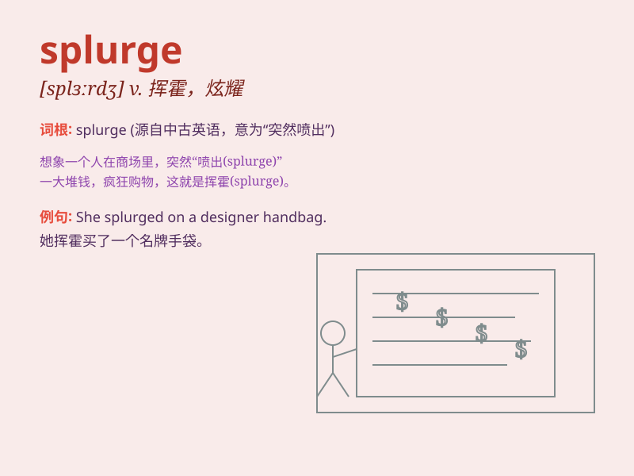

## splurge

**英音:** _[splɜːdʒ]_ **美音:** _[splɝdʒ]_

**译义:** *n.卖弄,炫耀,夸示vi.卖弄,炫耀,挥霍vt.挥霍*

### 短语

+ **splurge on:** _在\...\...上挥霍_

+ **make a splurge:** _大肆挥霍_

+ **go on a splurge:** _去挥霍一番_

+ **indulge in a splurge:** _沉溺于挥霍_

+ **splurge out:** _挥霍无度_

### 例句

#### 例句1

> **I decided to splurge and buy the expensive dress.**

**中文翻译:** 我决定挥霍一下，买那条昂贵的裙子。

**单词释义:** 挥霍；乱花钱

#### 例句2

> **They splurged on a luxurious vacation.**

**中文翻译:** 他们在一次奢华的度假上大肆挥霍。

**单词释义:** 大肆挥霍

#### 例句3

> **After getting a bonus, she splurged on new furniture for her
home.**

**中文翻译:** 拿到奖金后，她大手大脚地为家里买了新家具。

**单词释义:** 大手大脚地花钱

### 背诵小故事

> Once upon a time, Tom was always cautious with his money. But on his
birthday, he decided to splurge and bought an expensive watch he had
longed for. It means to spend money freely and extravagantly.

**从前，汤姆总是很谨慎地花钱。但在他生日那天，他决定大肆挥霍，买了一块他渴望已久的昂贵手表。这个词意思是挥霍、乱花钱。**

### 图义

