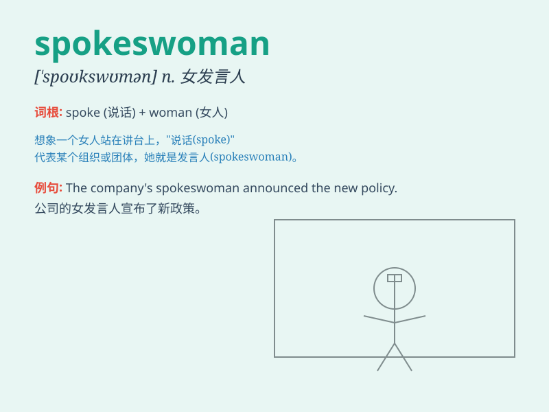

## spokeswoman

**英音:** _[ˈspəʊkswʊmən]_ **美音:** _[ˈspoʊkswʊmən]_

**译义:** *n.女发言人,女代言人*

### 短语

+ **chief spokeswoman:** _首席女发言人_

+ **company spokeswoman:** _公司女发言人_

+ **government spokeswoman:** _政府女发言人_

+ **official spokeswoman:** _官方女发言人_

+ **media spokeswoman:** _媒体女发言人_

### 例句

#### 例句1

> **The spokeswoman for the company announced the new product
launch.**

**中文翻译:** 公司的女发言人宣布了新产品的发布。

**单词释义:** 女发言人

#### 例句2

> **The government spokeswoman defended the policy in the press
conference.**

**中文翻译:** 政府的女发言人在新闻发布会上为这项政策辩护。

**单词释义:** 女发言人

#### 例句3

> **The charity spokeswoman appeared on TV to appeal for
donations.**

**中文翻译:** 慈善机构的女发言人出现在电视上呼吁捐款。

**单词释义:** 女发言人

### 背诵小故事

> A brave and confident woman was chosen as the spokeswoman for a big
event. She had to face many reporters and speak clearly. Her words were
like spokes of a wheel, spreading the important message.

**一位勇敢且自信的女士被选为一场大型活动的女发言人。她必须面对众多记者并清晰发言。她的话语就像车轮的辐条，传播着重要的信息。**

### 图义

