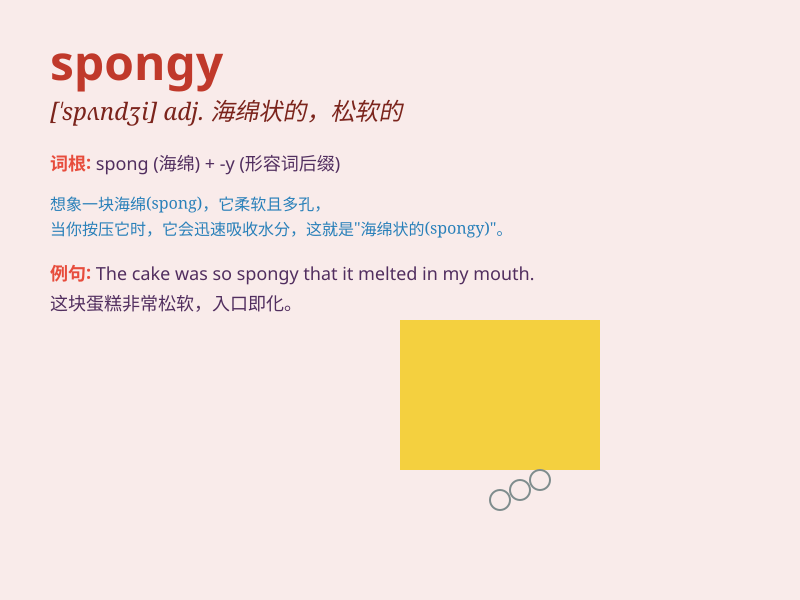

## spongy

**英音:** _[\'spʌn(d)ʒɪ]_ **美音:** _[\'spʌndʒi]_

**译义:** *adj.像海绵的,柔软,多孔而有弹性的*

### 短语

+ **spongy bone:** _松质骨_

+ **spongy tissue:** _海绵组织_

+ **spongy cake:** _海绵蛋糕_

+ **spongy rubber:** _海绵橡胶_

+ **spongy consistency:** _海绵状质地_

### 例句

#### 例句1

> **The bread had a spongy texture.**

**中文翻译:** 这块面包有一种松软的质地。

**单词释义:** 松软的

#### 例句2

> **The soil in this area is rather spongy after the rain.**

**中文翻译:** 雨后这个地区的土壤相当松软。

**单词释义:** 松软的

#### 例句3

> **His brain felt spongy and confused after the long illness.**

**中文翻译:** 久病之后他的大脑感觉迟钝混乱。

**单词释义:** 迟钝的；混乱的

### 背诵小故事

> A little monkey found a spongy cake in the forest. It was so soft and
springy like a sponge. The monkey loved it and kept saying\'spongy,
spongy\' to remember the wonderful texture.

**一只小猴子在森林里发现了一块松软的蛋糕。它像海绵一样柔软有弹性。猴子很喜欢，不停地说'spongy，spongy'来记住这美妙的质地。**

### 图义

