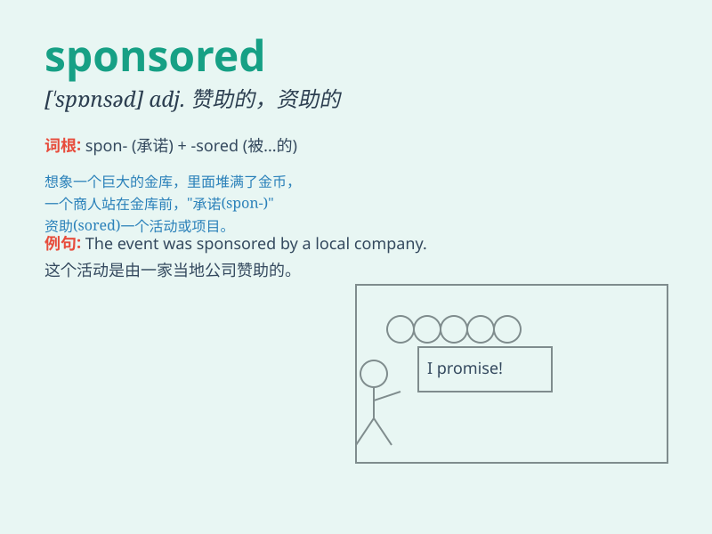

## sponsored

**英音:** _[ˈspɒnsəd]_ **美音:** _[ˈspɑːnsərd]_

**译义:** *adj. 赞助的；发起的；被赞助的 v. 赞助；发起（sponsor
的过去式和过去分词）*

### 短语

+ **sponsored event:** _赞助活动_

+ **sponsored content:** _赞助内容_

+ **sponsored project:** _赞助项目_

+ **sponsored athlete:** _受赞助的运动员_

+ **sponsored research:** _赞助研究_

### 例句

#### 例句1

> **The event was sponsored by a local company.**

**中文翻译:** 这个活动是由一家当地公司赞助的。

**单词释义:** 赞助

#### 例句2

> **She received a sponsored trip to Europe.**

**中文翻译:** 她获得了一次由赞助的欧洲之旅。

**单词释义:** 由......赞助

#### 例句3

> **The sponsored athlete performed exceptionally well.**

**中文翻译:** 这位受赞助的运动员表现得格外出色。

**单词释义:** 受赞助的

### 背诵小故事

> 想象一个贫困的学生，因为学习优秀，获得了一家大企业的 sponsored
支持。企业为他支付学费和生活费，就像赞助运动员一样，让他能安心求学。

**想象一个贫困学生因优秀而得到一家大企业的赞助，企业为其支付费用，助其安心求学。**

### 图义

