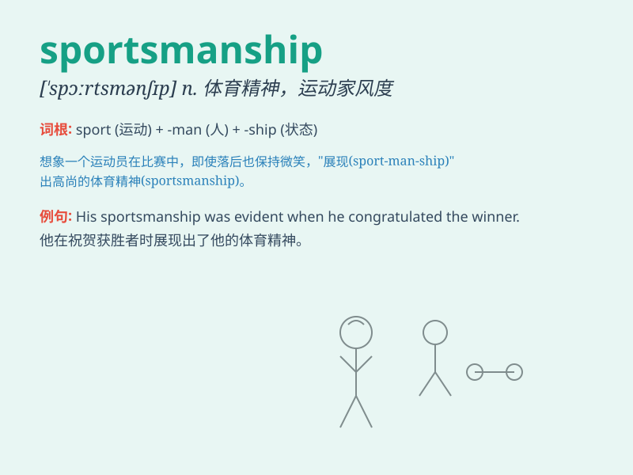

## sportsmanship

**英音:** _[\'spɔːtsmənʃɪp]_ **美音:**
_[\'spɔrtsmən\'ʃɪp]_

**译义:** *n.运动家精神*

### 短语

+ **good sportsmanship:** _良好的体育精神_

+ **poor sportsmanship:** _不良的体育精神_

+ **show sportsmanship:** _展现体育精神_

+ **lack of sportsmanship:** _缺乏体育精神_

+ **admire sportsmanship:** _钦佩体育精神_

### 例句

#### 例句1

> **Good sportsmanship is essential in any competitive game.**

**中文翻译:** 在任何竞技比赛中，良好的体育精神都是必不可少的。

**单词释义:** 体育精神

#### 例句2

> **The athlete was praised for his outstanding sportsmanship.**

**中文翻译:** 这位运动员因其出色的体育精神而受到赞扬。

**单词释义:** 体育精神

#### 例句3

> **Lack of sportsmanship can lead to disqualification in the
tournament.**

**中文翻译:** 缺乏体育精神可能会导致在锦标赛中被取消资格。

**单词释义:** 体育精神

### 背诵小故事

> In a fierce football match, one team was losing. But instead of
getting angry, they congratulated the winning team and showed no signs
of bad behavior. This is what sportsmanship means - fair play and
respect for others.

**在一场激烈的足球比赛中，有一支队伍输了。但他们没有生气，而是向获胜队伍表示祝贺，没有不良行为。这就是体育精神的含义------公平竞争和尊重他人。**

### 图义

