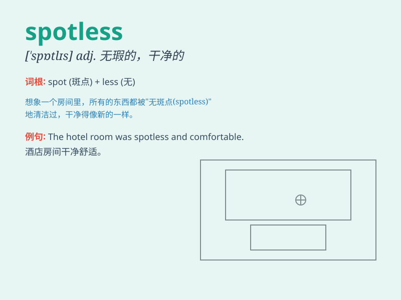

## spotless

**英音:** _[\'spɒtlɪs]_ **美音:** _[\'spɑtləs]_

**译义:** *adj.没有污点的*

### 短语

+ **spotless record:** _无污点的记录_

+ **spotless reputation:** _清白的声誉_

+ **spotless kitchen:** _一尘不染的厨房_

+ **spotless floor:** _干净的地板_

+ **spotless bathroom:** _洁净的浴室_

### 例句

#### 例句1

> **The hotel room was spotless, with not a speck of dust
anywhere.**

**中文翻译:** 酒店房间一尘不染，任何地方都没有一点灰尘。

**单词释义:** 一尘不染的

#### 例句2

> **She always keeps her kitchen spotless after cooking.**

**中文翻译:** 她做饭后总是把厨房保持得干干净净。

**单词释义:** 干净的

#### 例句3

> **His white shirt was spotless even after a long day at work.**

**中文翻译:** 他的白衬衫即使在工作了一整天后还是洁白无瑕。

**单词释义:** 洁白无瑕的

### 背诵小故事

> Once upon a time, a prince was looking for a princess with a spotless
heart. He traveled far and wide until he found her. Her kindness and
purity made her truly spotless. So, spotless means completely clean and
without any marks or faults.

**从前，有一位王子在寻找一位心灵无暇的公主。他四处寻觅，直到找到了她。她的善良和纯洁使她真正一尘不染。所以，spotless
意思是完全干净的，没有任何污点或过错。**

### 图义

