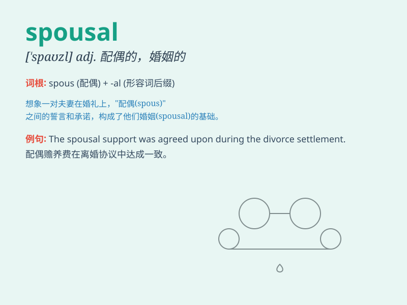

## spousal

**英音:** _[ˈspaʊzl]_ **美音:** _[ˈspaʊzl]_

**译义:** *n.结婚,婚礼adj.结婚的*

### 短语

+ **spousal support:** _配偶赡养费_

+ **spousal relationship:** _配偶关系_

+ **spousal consent:** _配偶同意_

+ **spousal abuse:** _配偶虐待_

+ **spousal visa:** _配偶签证_

### 例句

#### 例句1

> **The spousal relationship requires mutual understanding and
support.**

**中文翻译:** 夫妻关系需要相互理解和支持。

**单词释义:** 夫妻的

#### 例句2

> **She filed for spousal support after the divorce.**

**中文翻译:** 离婚后，她申请了配偶赡养费。

**单词释义:** 配偶的

#### 例句3

> **The spousal visa application process can be quite complex.**

**中文翻译:** 配偶签证的申请过程可能相当复杂。

**单词释义:** 配偶的

### 背诵小故事

> A prince was looking for his spousal. He traveled far and wide until
he met a kind and beautiful girl. They fell in love and had a happy life
together. The prince knew she was his perfect spousal.

**一位王子正在寻找他的配偶。他四处游历，直到遇到了一位善良美丽的女孩。他们坠入爱河，一起过上了幸福的生活。王子知道她就是他完美的配偶。**

### 图义

