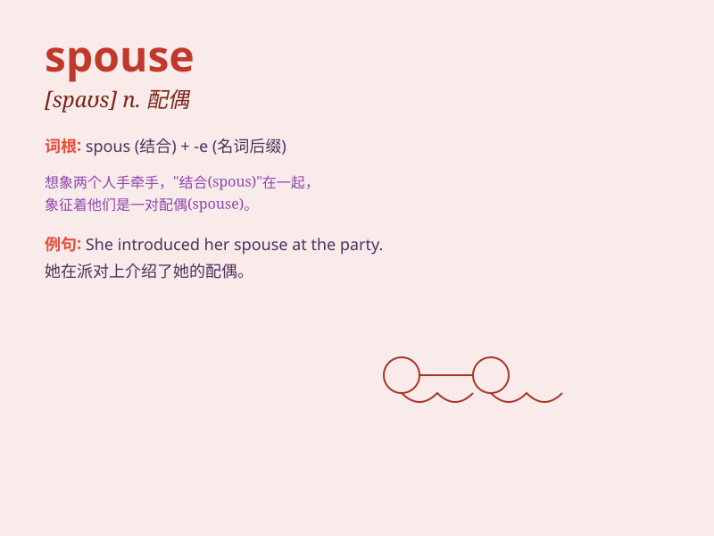

## spouse

**英音:** _[spaʊz; -s]_ **美音:** _[spaʊs]_

**译义:** *n.配偶(指夫或妻)*

### 短语

+ **legal spouse:** _合法配偶_

+ **former spouse:** _前任配偶_

+ **spouse support:** _配偶赡养费_

+ **common-law spouse:** _习惯法配偶_

+ **dependent spouse:** _受扶养配偶_

### 例句

#### 例句1

> **My spouse and I have been married for ten years.**

**中文翻译:** 我的配偶和我已经结婚十年了。

**单词释义:** 配偶

#### 例句2

> **She was deeply in love with her spouse.**

**中文翻译:** 她深深地爱着她的配偶。

**单词释义:** 配偶

#### 例句3

> **After the divorce, he had to face life without his spouse.**

**中文翻译:** 离婚后，他不得不面对没有配偶的生活。

**单词释义:** 配偶

### 背诵小故事

> Once upon a time, a prince was seeking a spouse. He traveled far and
wide until he met a kind and beautiful girl. They fell in love and she
became his spouse. Remember, spouse means a husband or wife.

**从前，有一位王子在寻找配偶。他四处游历，直到遇见了一位善良美丽的女孩。他们相爱了，女孩成为了他的配偶。记住，spouse
意思是配偶（丈夫或妻子）。**

### 图义

