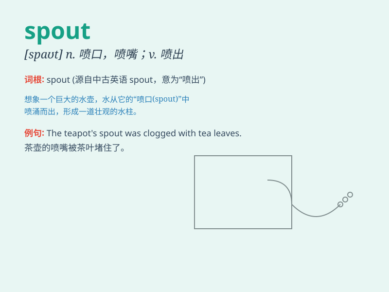

## spout

**英音:** _[spaʊt]_ **美音:** _[spaʊt]_

**译义:** *n.喷管,喷口,水柱,喷流,管口v.喷出,滔滔不绝地讲,喷涌*

### 短语

+ **water spout:** _水龙卷；海上龙卷风_

+ **oil spout:** _喷油嘴；油嘴_

+ **spout off:** _夸夸其谈；信口开河_

+ **spout out:** _喷出；滔滔不绝地说_

+ **chimney spout:** _烟囱帽；烟囱顶管_

### 例句

#### 例句1

> **The whale spouted water from its blowhole.**

**中文翻译:** 鲸鱼从它的呼吸孔喷出了水。

**单词释义:** 喷出；喷射

#### 例句2

> **The teapot has a broken spout.**

**中文翻译:** 这个茶壶有一个破损的壶嘴。

**单词释义:** 壶嘴；喷嘴

#### 例句3

> **He would spout off about politics for hours.**

**中文翻译:** 他会滔滔不绝地谈论政治好几个小时。

**单词释义:** 滔滔不绝地说

### 背诵小故事

> A little bird was standing on the edge of a water spout. Suddenly,
water started to spout out forcefully. The bird was so surprised and
flew away quickly.

**一只小鸟站在一个水嘴的边缘。突然，水开始强有力地喷出。小鸟非常惊讶，迅速飞走了。**

### 图义

