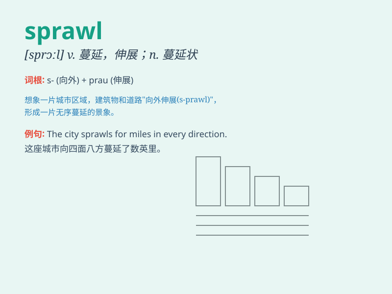

## sprawl

**英音:** _[sprɔːl]_ **美音:** _[sprɔl]_

**译义:**
*n.四肢伸开的躺卧姿势,蔓生v.四肢伸开地坐(或卧),爬行,蔓生,蔓延*

### 短语

+ **urban sprawl:** _城市扩张；城市无计划扩展_

+ **sprawl out:** _伸展开；四肢摊开_

+ **sprawl across:** _蔓延穿过；横亘_

+ **sprawl along:** _沿着\...蔓延；顺着\...伸展_

+ **sprawl on the ground:** _躺在地上四肢摊开_

### 例句

#### 例句1

> **The city has expanded in all directions in a chaotic sprawl.**

**中文翻译:** 这座城市向四面八方无序地扩张开来。

**单词释义:** 蔓延；杂乱无序地扩展

#### 例句2

> **He was sprawled on the sofa, watching TV.**

**中文翻译:** 他四肢摊开躺在沙发上看电视。

**单词释义:** 四肢摊开着坐（或躺）

#### 例句3

> **The books were sprawled all over the desk.**

**中文翻译:** 书摊了一桌子。

**单词释义:** 摊开；散开

### 背诵小故事

> 想象一个人在公园里，累得不行，直接就 sprawl
在了草坪上，四肢随意伸展，毫无规矩。就像这个随意伸展躺卧的动作，sprawl
就是指四肢摊开、杂乱无序地伸展或分布。

**想象一个人在公园随意伸展躺卧的场景来理解 sprawl
这个词，意思是四肢摊开、杂乱无序地伸展或分布。**

### 图义

