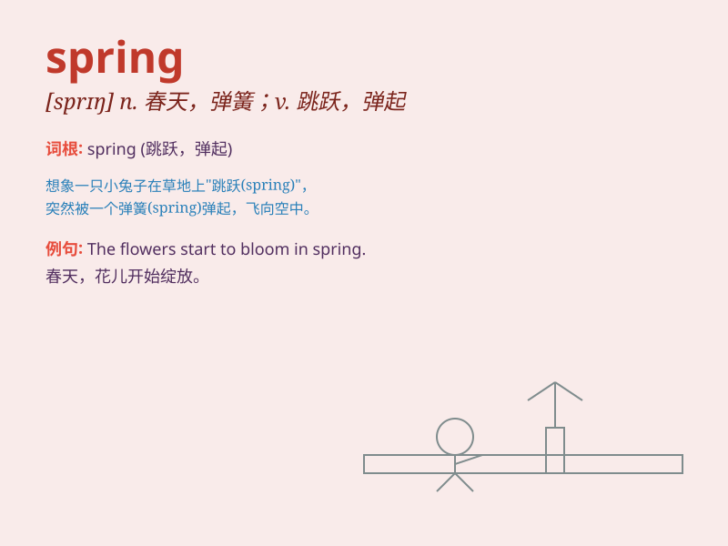

## spring

**英音:** _[sprɪŋ]_ **美音:** _[sprɪŋ]_

**译义:**
*n.春天,跃起,泉,弹簧,发条,弹性,弹力,根源v.跳,跃,跃出,使跳跃,使爆炸,触发*

### 短语

+ **spring up:** _突然出现；迅速生长_

+ **spring from:** _起源于；来自_

+ **spring into action:** _突然行动起来_

+ **spring water:** _泉水_

+ **spring tide:** _大潮；涨潮_

### 例句

#### 例句1

> **The flowers bloom in spring.**

**中文翻译:** 花朵在春天绽放。

**单词释义:** 春天

#### 例句2

> **The spring of the sofa is broken.**

**中文翻译:** 这个沙发的弹簧坏了。

**单词释义:** 弹簧

#### 例句3

> **She has a spring in her step.**

**中文翻译:** 她脚步轻快。

**单词释义:** 活力；朝气

### 背诵小故事

> A little rabbit was playing in the forest in spring. The flowers were
blooming, and the grass was turning green. The warm sun made everything
lively. The rabbit hopped happily, enjoying this wonderful season.

**一只小兔子在春天里在森林里玩耍。花儿正在绽放，草儿正在变绿。温暖的太阳让一切都充满生机。小兔子欢快地蹦跳着，享受着这个美好的季节。**

### 图义

