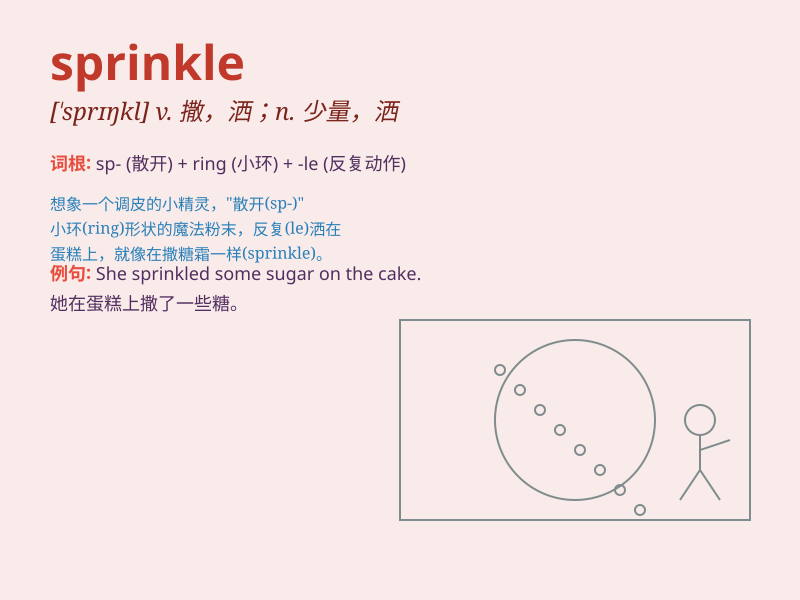

## sprinkle

**英音:** _[\'sprɪŋk(ə)l]_ **美音:** _[\'sprɪŋkl]_

**译义:** *v.撒(某物)于(某物之表面),洒,喷撒*

### 短语

+ **sprinkle water:** _洒水_

+ **sprinkle salt:** _撒盐_

+ **sprinkle powder:** _撒粉_

+ **sprinkle stars:** _繁星点点_

+ **sprinkle sugar:** _撒糖_

### 例句

#### 例句1

> **She sprinkled sugar on the cupcakes.**

**中文翻译:** 她在纸杯蛋糕上撒了糖。

**单词释义:** 撒

#### 例句2

> **The gardener sprinkled water on the flowers to keep them
fresh.**

**中文翻译:** 园丁给花洒水以保持它们新鲜。

**单词释义:** 洒；喷淋

#### 例句3

> **He sprinkled some salt on the meat before cooking it.**

**中文翻译:** 他在烹饪肉之前撒了些盐在上面。

**单词释义:** 撒；撒上

### 背诵小故事

> One day, it was very hot. Tom took a watering can and began to
sprinkle water on the flowers to make them cool. The water droplets were
like little stars falling from the sky.

**一天，天气很热。汤姆拿着喷壶开始向花洒水，让它们凉快些。水滴就像从天上落下的小星星。**

### 图义

