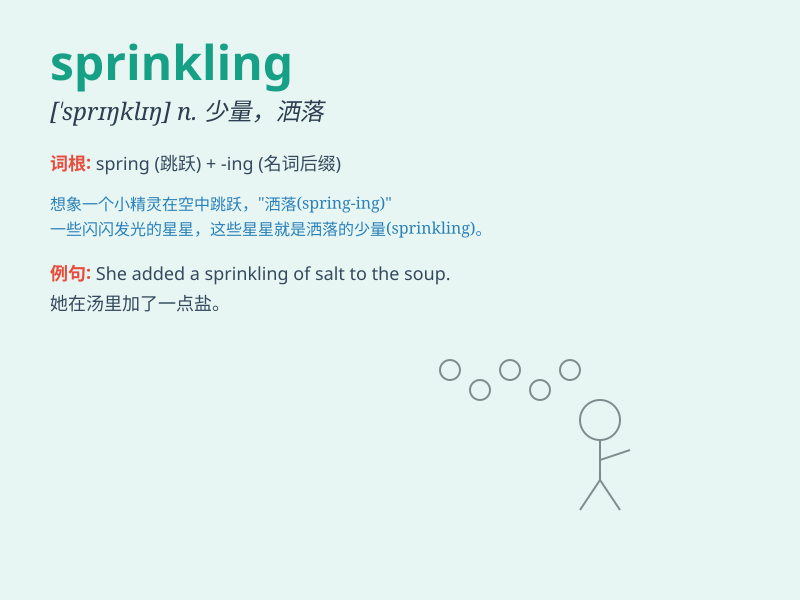

## sprinkling

**英音:** _[\'sprɪŋklɪŋ]_ **美音:** _[\'sprɪŋklɪŋ]_

**译义:** * vbl.洒水*

### 短语

+ **a sprinkling of:** _少量的；一点儿_

+ **sprinkling system:** _喷淋系统_

+ **sprinkling device:** _喷洒装置_

+ **sprinkling can:** _喷壶；洒水壶_

+ **sprinkling water:** _洒水；喷水_

### 例句

#### 例句1

> **She added a sprinkling of salt to the soup.**

**中文翻译:** 她往汤里加了一点盐。

**单词释义:** 少量；一点点

#### 例句2

> **The cake had a sprinkling of chocolate chips on top.**

**中文翻译:** 这个蛋糕顶部有少量的巧克力碎片。

**单词释义:** 少量；少许

#### 例句3

> **There was a sprinkling of stars in the night sky.**

**中文翻译:** 夜空中有稀疏的几颗星星。

**单词释义:** 稀疏的分布；零星的数量

### 背诵小故事

> One sunny day, a fairy was flying over a garden. With a magic wand,
she did a sprinkling of colorful flower seeds. Soon, the garden was
filled with beautiful blossoms. The act of the fairy\'s scattering was
like a \'sprinkling\'.

**在一个阳光明媚的日子，一个仙女飞过花园。她用魔法棒撒下了五颜六色的花种。很快，花园里开满了美丽的花朵。仙女这种播撒的行为就像是'sprinkling（少量；稀疏地洒；撒）'。**

### 图义

