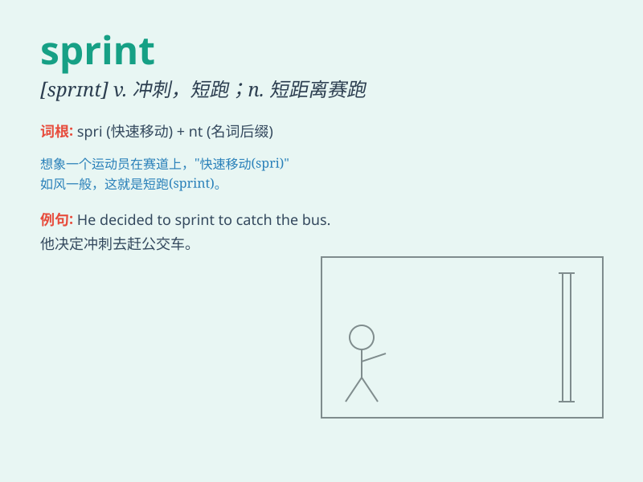

## sprint

**英音:** _[sprɪnt]_ **美音:** _[sprɪnt]_

**译义:** *v.疾跑 美国著名的通讯公司*

### 短语

+ **sprint race:** _短跑比赛_

+ **sprint training:** _短跑训练_

+ **power sprint:** _强力冲刺_

+ **final sprint:** _最后的冲刺_

+ **short sprint:** _短距离冲刺_

### 例句

#### 例句1

> **He sprinted to catch the bus.**

**中文翻译:** 他冲刺着去赶公交车。

**单词释义:** 冲刺

#### 例句2

> **The athlete sprinted towards the finish line.**

**中文翻译:** 这位运动员朝着终点线冲刺。

**单词释义:** 冲刺

#### 例句3

> **She sprinted across the field to meet her friend.**

**中文翻译:** 她冲过田野去见她的朋友。

**单词释义:** 冲刺

### 背诵小故事

> A little rabbit was being chased by a wolf. To escape, the rabbit had
to sprint as fast as it could. It ran with all its strength, finally
finding a safe hole. Sprint means to run very fast for a short distance.

**一只小兔子被狼追赶。为了逃跑，兔子不得不全力冲刺。它用尽全力奔跑，最后找到了一个安全的洞。Sprint
意思是短距离快速奔跑。**

### 图义

