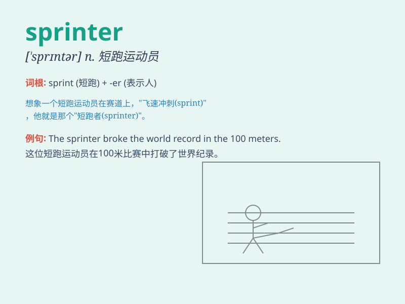

## sprinter

**英音:** _[\'sprɪntə]_ **美音:** _[\'sprɪntɚ]_

**译义:** *n.赛跑选手*

### 短语

+ **professional sprinter:** _职业短跑运动员_

+ **elite sprinter:** _精英短跑选手_

+ **fast sprinter:** _速度快的短跑运动员_

+ **young sprinter:** _年轻的短跑运动员_

+ **experienced sprinter:** _经验丰富的短跑运动员_

### 例句

#### 例句1

> **The sprinter crossed the finish line in record time.**

**中文翻译:** 这位短跑运动员以创纪录的时间冲过了终点线。

**单词释义:** 短跑运动员

#### 例句2

> **She has always dreamed of becoming a world-class sprinter.**

**中文翻译:** 她一直梦想成为一名世界级的短跑运动员。

**单词释义:** 短跑运动员

#### 例句3

> **The young sprinter showed great potential in the competition.**

**中文翻译:** 这位年轻的短跑运动员在比赛中展现出了巨大的潜力。

**单词释义:** 短跑运动员

### 背诵小故事

> A young athlete always dreamed of being the fastest sprinter. One
day, at the big race, he sprinted with all his strength and crossed the
finish line first. Now you remember, \'sprinter\' is a person who runs
very fast in short races.

**一位年轻的运动员一直梦想成为最快的短跑运动员。有一天，在大型比赛中，他全力冲刺并第一个冲过终点线。现在你记住，\'sprinter\'就是在短距离比赛中跑得很快的人。**

### 图义

