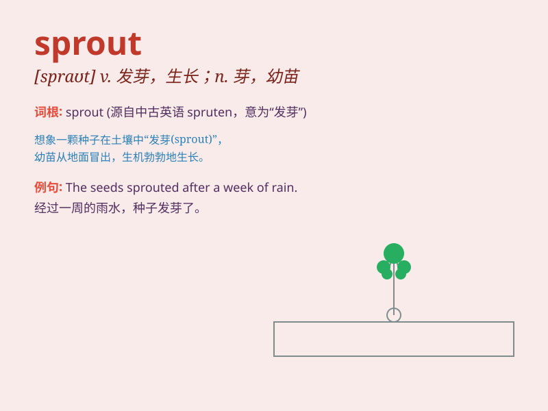

## sprout

**英音:** _[spraʊt]_ **美音:** _[spraʊt]_

**译义:** *v.萌芽n.苗芽*

### 短语

+ **sprout leaves:** _长出叶子_

+ **sprout up:** _迅速成长；突然出现_

+ **sprout buds:** _发芽；长出芽_

+ **sprout forth:** _涌现；大量出现_

+ **sprout new shoots:** _长出新枝_

### 例句

#### 例句1

> **The seeds will sprout in a few days.**

**中文翻译:** 这些种子几天后就会发芽。

**单词释义:** 发芽

#### 例句2

> **New leaves are sprouting from the branches.**

**中文翻译:** 新的叶子正从树枝上长出来。

**单词释义:** 长出

#### 例句3

> **She has a talent that is beginning to sprout.**

**中文翻译:** 她有一种正在开始展露的天赋。

**单词释义:** 展露

### 背诵小故事

>
想象一下，春天来了，一颗小小的种子在土里努力地生长。突然，它突破了土壤，发出了嫩绿的芽。这个芽就是\'sprout\'，意味着发芽、生长。

**想象春天，种子努力生长突破土壤发出绿芽，这个芽就是sprout，意思是发芽、生长。**

### 图义

