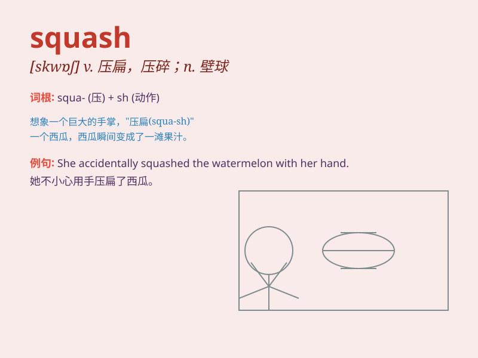

## squash

**英音:** _[skwɒʃ]_ **美音:** _[skwɔʃ]_

**译义:**
*n.南瓜,易压烂的物品,拥挤的人群,壁球v.压扁,压制,镇压,挤进,挤压*

### 短语

+ **squash court:** _壁球场_

+ **squash bug:** _南瓜虫_

+ **squash into:** _挤进_

+ **squash up:** _挤在一起_

+ **squash something flat:** _把某物压扁_

### 例句

#### 例句1

> **I like to eat squash in the summer.**

**中文翻译:** 我喜欢在夏天吃南瓜。

**单词释义:** 南瓜

#### 例句2

> **The car was squashed between two trucks.**

**中文翻译:** 那辆车被夹在两辆卡车中间压扁了。

**单词释义:** 压扁；挤压

#### 例句3

> **He managed to squash into the small room.**

**中文翻译:** 他设法挤进了那间小房间。

**单词释义:** 挤进

### 背诵小故事

> One day, I went to the farm and saw many pumpkins. I tried to squash
one with my foot, but it was too hard. Then I used a big stick and
finally managed to squash it. It was an interesting experience.

**有一天，我去农场看到很多南瓜。我试图用脚踩扁一个，但它太硬了。然后我用一根大棍子，终于成功把它压扁了。这是一次有趣的经历。**

### 图义

