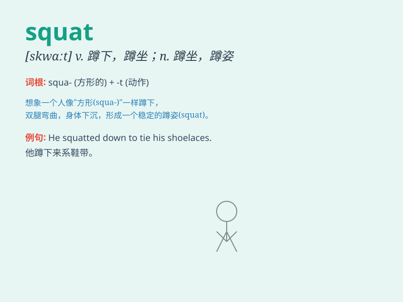

## squat

**英音:** _[skwɒt]_ **美音:** _[skwɑt]_

**译义:** *v.蹲坐,蹲伏n.蹲坐adj.蹲着的*

### 短语

+ **squat down:** _蹲下_

+ **squat position:** _蹲姿_

+ **squat jump:** _深蹲跳_

+ **squat toilet:** _蹲厕_

+ **squat rack:** _深蹲架_

### 例句

#### 例句1

> **He squatted down to tie his shoelaces.**

**中文翻译:** 他蹲下来系鞋带。

**单词释义:** 蹲，蹲下

#### 例句2

> **The building was a squat, ugly structure.**

**中文翻译:** 这座建筑又矮又丑。

**单词释义:** 矮而宽的

#### 例句3

> **They were forced to live in a squat.**

**中文翻译:** 他们被迫住在一处擅自占用的房子里。

**单词释义:** 擅自占用的房子

### 背诵小故事

> A thief wanted to steal jewels but had to squat in a dark corner to
avoid being seen. When the police came, he was still squatting there,
thinking he was hidden. Eventually, he was caught.

**一个小偷想要偷珠宝，但不得不蹲在一个黑暗的角落里以避免被发现。当警察来的时候，他还蹲在那里，以为自己藏好了。最终，他被抓住了。**

### 图义

