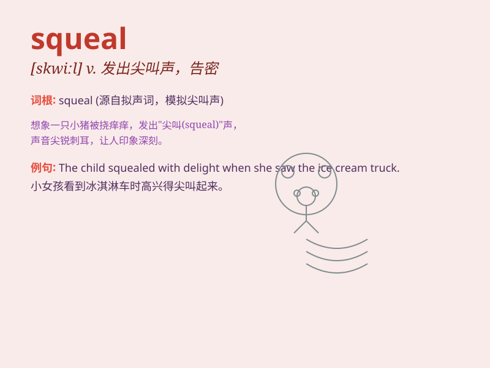

## squeal

**英音:** _[skwiːl]_ **美音:** _[skwil]_

**译义:** *v.长声尖叫,告密,抱怨,激烈抗议n.长而尖的声音*

### 短语

+ **squeal with delight:** _高兴得尖叫_

+ **squeal on someone:** _告发某人_

+ **let out a squeal:** _发出一声尖叫_

+ **squeal of protest:** _抗议的尖叫_

+ **give a squeal:** _尖叫一声_

### 例句

#### 例句1

> **The pig squealed in pain when it was stepped on.**

**中文翻译:** 当猪被踩到的时候，它痛苦地尖叫着。

**单词释义:** 尖叫

#### 例句2

> **The children squealed with delight when they saw the clowns.**

**中文翻译:** 孩子们看到小丑时高兴得尖叫起来。

**单词释义:** 尖叫（因高兴）

#### 例句3

> **She squealed on her friend for cheating in the exam.**

**中文翻译:** 她告发了她朋友考试作弊。

**单词释义:** 告发

### 背诵小故事

> One day, the little pig saw a big wolf. It was so scared that it
began to squeal loudly. The squeal attracted the farmer who came to
drive the wolf away. The pig was safe at last.

**有一天，小猪看到了一只大狼。它非常害怕，开始大声尖叫。尖叫声引来了农夫，农夫过来把狼赶走了。小猪最后安全了。**

### 图义

