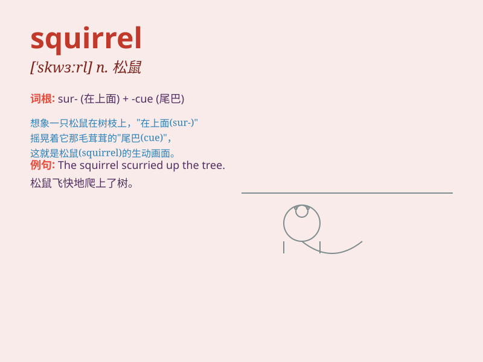

## squirrel

**英音:** _[\'skwɪr(ə)l]_ **美音:** _[ˈskwɜ:rəl;
skwɝəl]_

**译义:** *n.松鼠v.贮藏*

### 短语

+ **squirrel away:** _储存；贮存_

+ **tree squirrel:** _树松鼠_

+ **squirrel cage:** _鼠笼；鼠笼式_

+ **ground squirrel:** _地松鼠_

+ **flying squirrel:** _飞鼠；鼯鼠_

### 例句

#### 例句1

> **The squirrel is climbing up the tree.**

**中文翻译:** 这只松鼠正在往树上爬。

**单词释义:** 松鼠

#### 例句2

> **I saw a squirrel running across the lawn.**

**中文翻译:** 我看到一只松鼠跑过草坪。

**单词释义:** 松鼠

#### 例句3

> **The squirrel stored nuts for the winter.**

**中文翻译:** 这只松鼠为冬天储存坚果。

**单词释义:** 松鼠

### 背诵小故事

> A little squirrel was jumping among the trees. It had a fluffy tail
and was collecting nuts for the winter. It was so cute and smart,
running and hiding quickly. Remember, squirrel is this active and lovely
animal.

**一只小松鼠在树林间跳跃。它有一条蓬松的尾巴，正在为冬天收集坚果。它非常可爱和聪明，跑得很快还会躲藏。记住，squirrel
就是这种活跃又可爱的动物。**

### 图义

