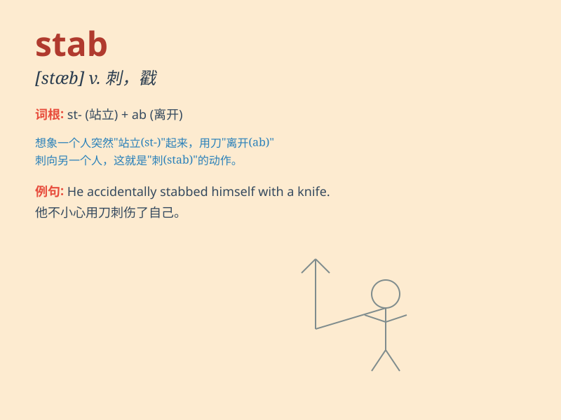

## stab

**英音:** _[stæb]_ **美音:** _[stæb]_

**译义:**
*n.刺,刺伤的伤口,一阵突然而强烈的感觉,中伤,伤痛v.剌,刺伤,伤害(感情等)*

### 短语

+ **stab in the back:** _背后中伤；背叛_

+ **stab wound:** _刺伤；刀伤_

+ **make a stab at:** _试图做；尝试_

+ **a stab of pain:** _一阵疼痛_

+ **stab someone to death:** _把某人刺死_

### 例句

#### 例句1

> **He stabbed the knife into the wood.**

**中文翻译:** 他把刀刺入木头里。

**单词释义:** 用（刀等）刺；戳

#### 例句2

> **The thief stabbed her in the back.**

**中文翻译:** 那个小偷在她背上捅了一刀。

**单词释义:** （用刀等凶器）刺伤

#### 例句3

> **She felt a stab of pain in her chest.**

**中文翻译:** 她感到胸部一阵刺痛。

**单词释义:** 刺痛；剧痛

### 背诵小故事

> One dark night, a thief sneaked into a house. The owner was awakened
and saw the thief. In a panic, the thief took out a knife and STABbed
the owner. It was a terrifying scene.

**在一个漆黑的夜晚，一个小偷潜入一间房子。主人被惊醒并看见了小偷。慌乱中，小偷拿出一把刀并刺向了主人。这是一个可怕的场景。**

### 图义

