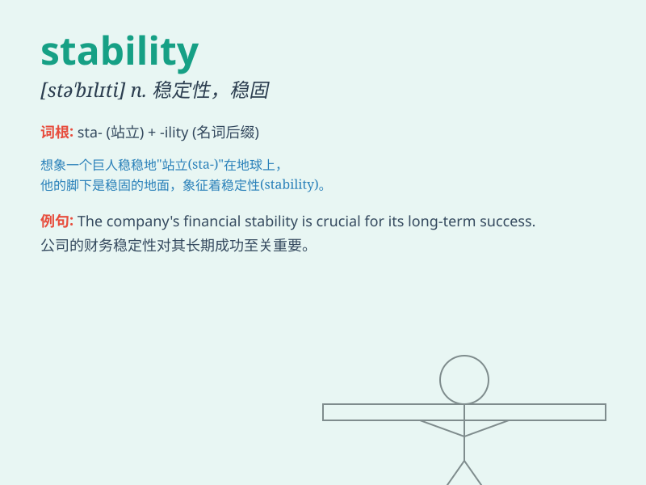

## stability

**英音:** _[stə\'bɪlɪtɪ]_ **美音:** _[stə\'bɪləti]_

**译义:** *n.稳定性*

### 短语

+ **economic stability:** _经济稳定_

+ **political stability:** _政治稳定_

+ **social stability:** _社会稳定_

+ **stability factor:** _稳定因素_

+ **stability margin:** _稳定裕度_

### 例句

#### 例句1

> **The stability of the economy is crucial for a country\'s
development.**

**中文翻译:** 经济的稳定对于一个国家的发展至关重要。

**单词释义:** 稳定；稳固

#### 例句2

> **The bridge was built to ensure the stability of the road
connection.**

**中文翻译:** 这座桥的建造是为了确保道路连接的稳定性。

**单词释义:** 稳定性

#### 例句3

> **Political stability is necessary for social progress.**

**中文翻译:** 政治稳定对于社会进步是必要的。

**单词释义:** 稳定（状态）

### 背诵小故事

> A little bird was always afraid of the wind and rain. But when it
found a stable tree branch, it felt safe. The branch didn\'t shake or
move, giving the bird a sense of stability. Now you know, stability
means being firm and not changing easily.

**一只小鸟总是害怕风雨。但当它找到一根稳固的树枝时，它感到安全。树枝不摇晃也不动，给了小鸟一种稳定的感觉。现在你知道了，stability
意思是稳固、不易改变。**

### 图义

