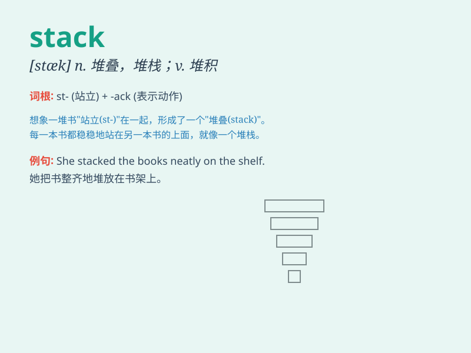

## stack

**英音:** _[stæk]_ **美音:** _[stæk]_

**译义:** *n.堆,一堆,堆栈v.堆叠*

### 短语

+ **stack up:** _（使）堆积；（使）累加；比得上；符合标准_

+ **stack the deck:** _作弊；暗中布局（使情况对某人有利或不利）_

+ **a stack of:** _一堆；一摞；大量_

+ **in stack:** _成堆；成叠_

+ **stack with:** _堆满；装满_

### 例句

#### 例句1

> **The books were neatly stacked on the shelf.**

**中文翻译:** 这些书整齐地堆放在书架上。

**单词释义:** 堆放；堆叠

#### 例句2

> **He had a stack of papers on his desk.**

**中文翻译:** 他的桌子上有一叠文件。

**单词释义:** 一叠；一堆

#### 例句3

> **The firewood was stacked up against the wall.**

**中文翻译:** 木柴靠墙码放着。

**单词释义:** 码放；堆放

### 背诵小故事

>
想象一个图书馆，书籍被整齐地堆放在一起，形成了一个个高高的堆。这些堆就像\'stack\'。管理员需要整理这些stack，以方便读者找到他们想要的书。

**想象在图书馆中书籍整齐堆叠成堆的情景，就像单词\'stack\'所表示的，管理员整理这些堆以便读者找书。**

### 图义

