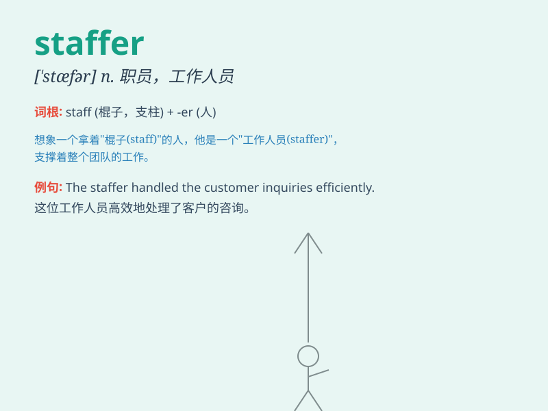

## staffer

**英音:** _[\'stɑːfə]_ **美音:** _[\'stæfɚ]_

**译义:** *n.编辑,职员*

### 短语

+ **senior staffer:** _高级职员_

+ **political staffer:** _政治工作人员_

+ **campaign staffer:** _竞选工作人员_

+ **government staffer:** _政府职员_

+ **press staffer:** _新闻工作人员_

### 例句

#### 例句1

> **The company hired a new staffer to handle marketing.**

**中文翻译:** 公司雇了一名新员工来处理市场营销。

**单词释义:** 员工；职员

#### 例句2

> **The political campaign relied on experienced staffers to organize
events.**

**中文翻译:** 这场政治竞选活动依靠有经验的工作人员来组织活动。

**单词释义:** 工作人员

#### 例句3

> **The newsroom was filled with busy staffers working on the latest
story.**

**中文翻译:** 新闻编辑室里满是忙着处理最新报道的员工。

**单词释义:** 员工

### 背诵小故事

> A company needed a new staffer. They interviewed many people.
Finally, they chose a hardworking and smart person. This new staffer
brought great help to the company.

**一家公司需要一名新员工。他们面试了很多人。最后，他们选择了一个勤奋又聪明的人。这位新员工给公司带来了很大的帮助。**

### 图义

