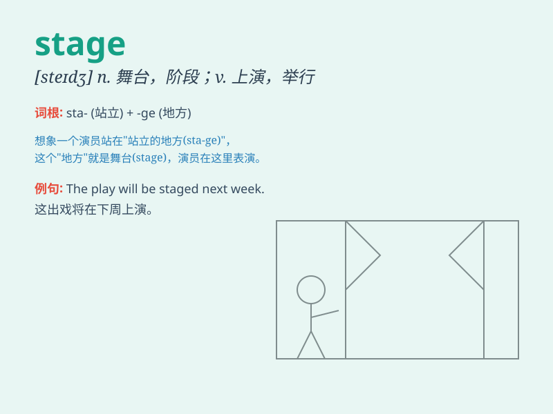

## stage

**英音:** _[steɪdʒ]_ **美音:** _[stedʒ]_

**译义:**
*n.舞台,戏剧,活动场所,发展的进程,阶段或时期,驿站vt.上演,筹备,举行*

### 短语

+ **stage fright:** _怯场_

+ **stage name:** _艺名_

+ **on stage:** _在舞台上；在台上_

+ **set the stage:** _为\...做好准备；为\...创造条件_

+ **stage direction:** _舞台指导；舞台指示_

### 例句

#### 例句1

> **The play is in three stages.**

**中文翻译:** 这部戏分三幕。

**单词释义:** 阶段；时期

#### 例句2

> **She was on stage for most of the play.**

**中文翻译:** 这出戏大部分时间她都在台上。

**单词释义:** 舞台

#### 例句3

> **The product is still at the development stage.**

**中文翻译:** 该产品仍处于开发阶段。

**单词释义:** 阶段；时期

### 背诵小故事

> A young actor was very nervous on the stage. But when he saw the
bright lights and heard the warm applause, he felt brave. The stage
became his world to shine.

**一位年轻的演员在舞台上非常紧张。但当他看到明亮的灯光，听到热烈的掌声时，他变得勇敢起来。这个舞台成为了他闪耀的世界。**

### 图义

