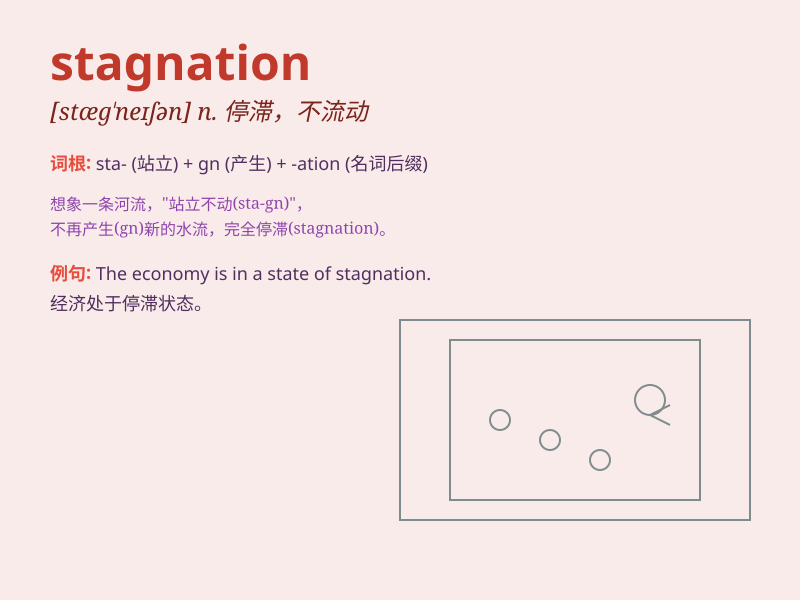

## stagnation

**英音:** _[stæɡ\'neɪʃən]_ **美音:** _[stæg\'neʃən]_

**译义:** *n.停滞*

### 短语

+ **economic stagnation:** _经济停滞_

+ **market stagnation:** _市场停滞_

+ **industrial stagnation:** _工业停滞_

+ **stagnation point:** _停滞点_

+ **stagnation period:** _停滞期_

### 例句

#### 例句1

> **The country\'s economy has been in a state of stagnation for
several years.**

**中文翻译:** 这个国家的经济已经停滞了好几年。

**单词释义:** 停滞；不发展

#### 例句2

> **There is a sense of stagnation in the job market.**

**中文翻译:** 就业市场有一种停滞的感觉。

**单词释义:** 停滞；萧条

#### 例句3

> **The company\'s sales have shown signs of stagnation recently.**

**中文翻译:** 这家公司的销售额最近有停滞的迹象。

**单词释义:** 停滞；没有增长

### 背诵小故事

> A little fish swam in a pool. But the water was not flowing. It felt
trapped and sad. This was the state of stagnation. The fish longed for a
moving current.

**一条小鱼在一个池塘里游。但水不流动。它感到被困住且难过。这就是停滞的状态。小鱼渴望流动的水流。**

### 图义

