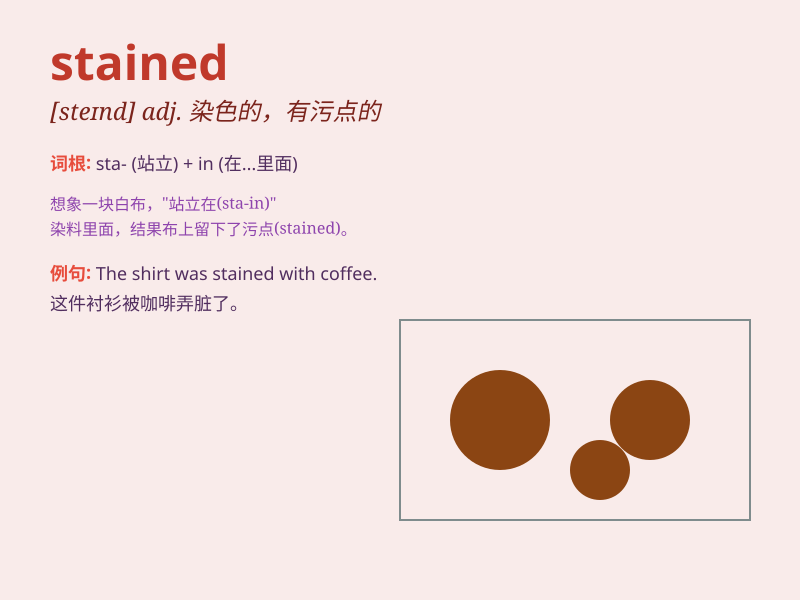

## stained

**英音:** _[steɪnd]_ **美音:** _[stend]_

**译义:**
*adj.有污点的，被玷污的；v.沾污，染色（stain的过去式和过去分词形式）*

### 短语

+ **stained glass:** _彩色玻璃_

+ **stained clothes:** _沾污的衣服_

+ **stained teeth:** _染色的牙齿_

+ **stained reputation:** _受损的声誉_

+ **stained surface:** _有污渍的表面_

### 例句

#### 例句1

> **The white shirt was stained with ink.**

**中文翻译:** 这件白色衬衫被墨水弄脏了。

**单词释义:** 被弄脏；有污渍

#### 例句2

> **Her reputation was stained by the scandal.**

**中文翻译:** 她的名声被这起丑闻玷污了。

**单词释义:** 玷污；败坏

#### 例句3

> **The wooden floor was stained a dark color.**

**中文翻译:** 木地板被染成了深色。

**单词释义:** 给...染色；着色

### 背诵小故事

> A little girl accidentally spilled ink on her white dress and it
became stained. She was very sad because the stains were hard to clean.
But with her mother\'s help, they finally got rid of the stains.

**一个小女孩不小心把墨水洒在了她的白色连衣裙上，裙子被弄脏了。她非常伤心，因为污渍很难清理。但在她妈妈的帮助下，她们最终去掉了污渍。**

### 图义

