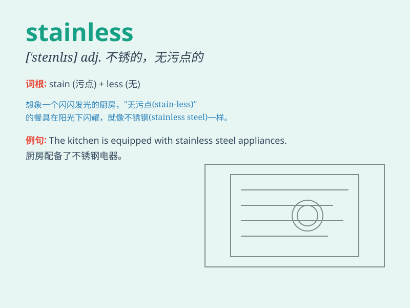

## stainless

**英音:** _[\'steɪnlɪs]_ **美音:** _[ˈsteɪnlɪs]_

**译义:** *adj.纯洁的,无瑕疵的,不锈的*

### 短语

+ **stainless steel:** _不锈钢_

+ **stainless finish:** _不锈钢表面处理_

+ **stainless quality:** _不锈钢品质_

+ **stainless surface:** _不锈钢表面_

+ **stainless material:** _不锈钢材料_

### 例句

#### 例句1

> **This knife is made of stainless steel and is very sharp.**

**中文翻译:** 这把刀是由不锈钢制成的，而且非常锋利。

**单词释义:** 不锈的；无污点的

#### 例句2

> **The bathroom fixtures are all stainless, making cleaning much
easier.**

**中文翻译:** 浴室的固定装置都是不锈钢的，这让清洁变得容易多了。

**单词释义:** 不锈的；无瑕疵的

#### 例句3

> **She wore a stainless white dress to the party.**

**中文翻译:** 她穿着一件洁白无瑕的裙子去参加聚会。

**单词释义:** 无污点的；纯洁的

### 背诵小故事

> A knight was searching for a special sword. Finally, he found one
that was stainless, meaning it had no stains or marks. It was shiny and
perfect, always ready for battle. The knight knew this stainless sword
would help him win.

**一位骑士正在寻找一把特殊的剑。最后，他找到了一把无污渍的剑，意味着它没有污点或痕迹。它闪闪发光且完美无瑕，随时准备战斗。骑士知道这把无污渍的剑会帮助他获胜。**

### 图义

