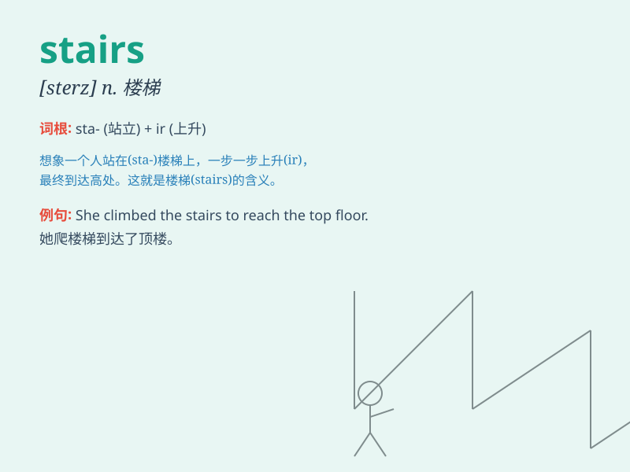

## stairs

**英音:** _[steəz]_ **美音:** _[stɛrz]_

**译义:** *n.楼梯*

### 短语

+ **climb the stairs:** _爬楼梯_

+ **downstairs:** _在楼下；往楼下_

+ **upstairs:** _在楼上；往楼上_

+ **stairs case:** _楼梯间_

+ **spiral stairs:** _螺旋楼梯_

### 例句

#### 例句1

> **She climbed up the stairs slowly.**

**中文翻译:** 她慢慢地爬上楼梯。

**单词释义:** 楼梯

#### 例句2

> **The cat jumped down the stairs in one leap.**

**中文翻译:** 那只猫一下子从楼梯上跳了下来。

**单词释义:** 楼梯

#### 例句3

> **He was carrying a heavy box up the stairs.**

**中文翻译:** 他正搬着一个重箱子上楼梯。

**单词释义:** 楼梯

### 背诵小故事

> One night, a little mouse was very hungry. It climbed up the stairs
carefully to find food. But it was so dark that it almost fell. Finally,
it reached the top and got a big piece of cheese. Remember, stairs are
steps that lead up and down.

**一天晚上，一只小老鼠非常饿。它小心翼翼地爬上楼梯去找食物。但太黑了，它差点摔下来。最后，它爬到了顶，得到了一大块奶酪。记住，stairs
就是上下楼的台阶。**

### 图义

