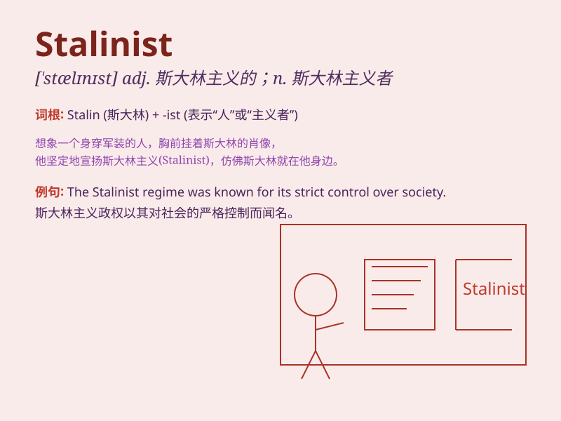

## Stalinist

**英音:** _[ˈstɑːlɪnɪst]_ **美音:** _[ˈstælɪnɪst]_

**译义:** *adj.斯大林主义的；n.斯大林主义者*

### 短语

+ **Stalinist regime:** _斯大林主义政权_

+ **Stalinist era:** _斯大林时代_

+ **Stalinist methods:** _斯大林主义的方法_

+ **Stalinist ideology:** _斯大林主义的意识形态_

+ **Stalinist purges:** _斯大林主义的清洗_

### 例句

#### 例句1

> **The Stalinist era was marked by significant political
changes.**

**中文翻译:** 斯大林主义时代以重大的政治变革为标志。

**单词释义:** 与斯大林主义有关的

#### 例句2

> **Some people still have strong opinions about Stalinist
policies.**

**中文翻译:** 一些人对斯大林主义的政策仍然有强烈的看法。

**单词释义:** 斯大林主义的

#### 例句3

> **The book explores the impact of Stalinist ideology.**

**中文翻译:** 这本书探讨了斯大林主义意识形态的影响。

**单词释义:** 斯大林主义的

### 背诵小故事

> Once upon a time, there was a person who strictly followed the ideas
and policies of Stalin. We call such a person a Stalinist. They were
known for their strong beliefs and actions related to those beliefs.

**从前，有一个人严格遵循斯大林的思想和政策。我们称这样的人为斯大林主义者。他们以其坚定的信念和与这些信念相关的行动而闻名。**

### 图义

