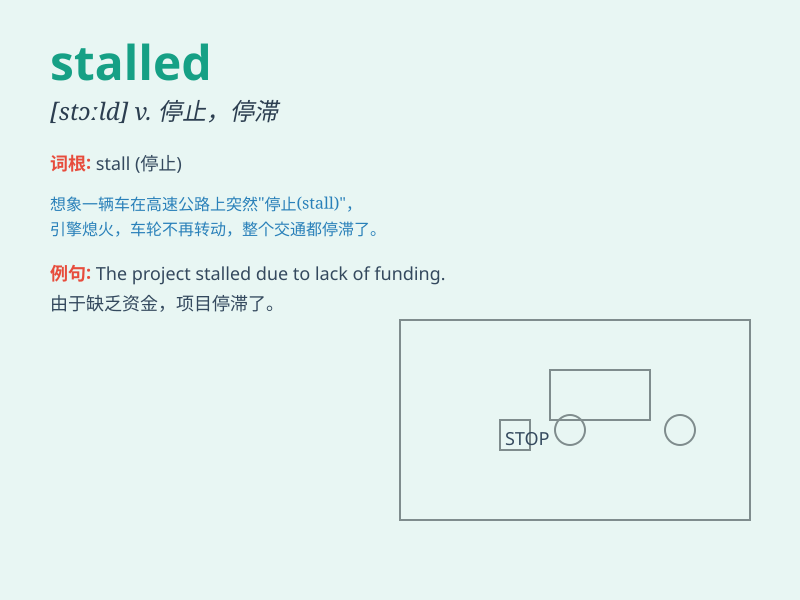

## stalled

**英音:** _[stɔːld]_ **美音:** _[stɔːld]_

**译义:** *adj. 失速的；停滞不前的；被困住的；v.
（使）熄火，抛锚；拖延，停顿（stall 的过去式和过去分词）*

### 短语

+ **stalled economy:** _停滞的经济_

+ **stalled project:** _停滞的项目_

+ **stalled car:** _熄火的汽车_

+ **stalled negotiations:** _陷入僵局的谈判_

+ **stalled progress:** _停滞不前的进展_

### 例句

#### 例句1

> **The car engine stalled at the traffic lights.**

**中文翻译:** 汽车发动机在交通灯处熄火了。

**单词释义:** （发动机）熄火

#### 例句2

> **The peace talks have stalled again.**

**中文翻译:** 和平谈判又停滞了。

**单词释义:** 停滞；停顿

#### 例句3

> **His career seemed to have stalled.**

**中文翻译:** 他的事业似乎停滞不前了。

**单词释义:** 停滞；没有进展

### 背诵小故事

> A car was driving on a mountain road. Suddenly, it stalled. The
driver was very worried. He tried to restart the engine many times but
failed. Finally, a mechanic came and fixed the problem.

**一辆汽车正在山路上行驶。突然，它熄火了。司机非常担心。他多次尝试重新启动引擎，但都失败了。最后，一位机械师来了并解决了问题。**

### 图义

