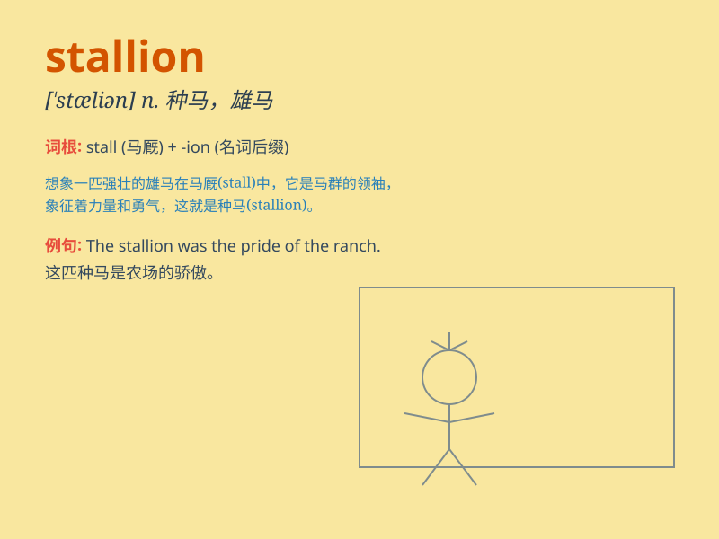

## stallion

**英音:** _[\'stæljən]_ **美音:** _[\'stæljən]_

**译义:** *n.牡马(尤指种马),留种的雄兽*

### 短语

+ **wild stallion:** _野生的种马_

+ **black stallion:** _黑色的种马_

+ **magnificent stallion:** _华丽的种马_

+ **racing stallion:** _赛马用的种马_

+ **strong stallion:** _强壮的种马_

### 例句

#### 例句1

> **The stallion galloped freely across the field.**

**中文翻译:** 这匹种马在田野上自由地飞奔。

**单词释义:** 种马

#### 例句2

> **The rancher was proud of his prize-winning stallion.**

**中文翻译:** 这位牧场主为他那匹获奖的种马感到骄傲。

**单词释义:** 种马

#### 例句3

> **The black stallion was a magnificent sight.**

**中文翻译:** 那匹黑色的种马是一道壮丽的风景。

**单词释义:** 种马

### 背诵小故事

> Once upon a time, a young boy visited a farm. There, he saw a
powerful and strong horse, which the farmer called a \'stallion\'. The
stallion ran freely and gracefully, leaving a deep impression on the
boy.

**从前，一个小男孩参观了一个农场。在那里，他看到了一匹强壮有力的马，农夫称其为"种马"。这匹种马自由而优雅地奔跑着，给男孩留下了深刻的印象。**

### 图义

