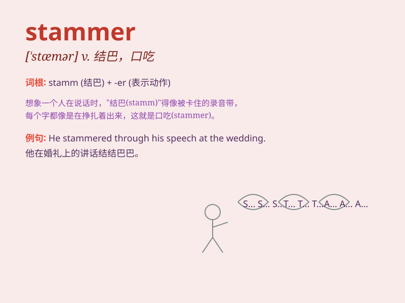

## stammer

**英音:** _[\'stæmə]_ **美音:** _[\'stæmɚ]_

**译义:** *v.口吃,结巴着说出,结结巴巴地说n.口吃*

### 短语

+ **stammer out:** _结结巴巴地说出_

+ **stammer through:** _口吃地完成_

+ **stammer nervously:** _紧张地结巴_

+ **begin to stammer:** _开始口吃_

+ **habitual stammer:** _习惯性口吃_

### 例句

#### 例句1

> **He tends to stammer when he gets nervous.**

**中文翻译:** 他一紧张就往往口吃。

**单词释义:** 口吃；结巴着说

#### 例句2

> **The child began to stammer as she tried to answer the
question.**

**中文翻译:** 这孩子试图回答问题时开始结巴起来。

**单词释义:** 说话结结巴巴

#### 例句3

> **She stammered her apology.**

**中文翻译:** 她结结巴巴地道歉。

**单词释义:** 结结巴巴地说

### 背诵小故事

> 有一天，小明在演讲时非常紧张，他的嘴巴好像不听使唤，说话总是 stammer
结巴。同学们都很友善，鼓励他慢慢说。最终小明克服了紧张，不再 stammer
了。

**有一天，小明在演讲时很紧张，他说话结巴。同学们鼓励他，最后他不再结巴了。**

### 图义

