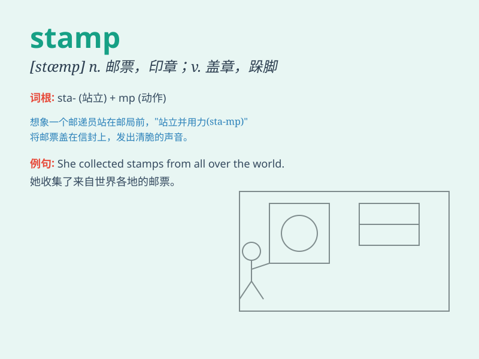

## stamp

**英音:** _[stæmp]_ **美音:** _[stæmp]_

**译义:**
*n.邮票,印花,印,图章,标志,印记,跺脚,顿足v.跺(脚),顿(足),压印*

### 短语

+ **stamp collection:** _邮票收集_

+ **stamp duty:** _印花税_

+ **postage stamp:** _邮票_

+ **stamp out:** _扑灭；消除_

+ **time stamp:** _时间戳_

### 例句

#### 例句1

> **She carefully placed the stamp on the envelope.**

**中文翻译:** 她小心地把邮票贴在信封上。

**单词释义:** 邮票

#### 例句2

> **The machine stamps out metal parts.**

**中文翻译:** 这台机器冲压出金属零件。

**单词释义:** 冲压

#### 例句3

> **His foot left a stamp in the soft mud.**

**中文翻译:** 他的脚在软泥里留下了一个脚印。

**单词释义:** 脚印；印记

### 背诵小故事

> One day, Tom received a letter. But there was no stamp on it, so it
couldn\'t be sent. Tom quickly bought a stamp and stuck it on the
envelope. Finally, the letter was sent successfully.

**一天，汤姆收到一封信。但上面没有邮票，所以无法寄出。汤姆迅速买了一张邮票并贴在信封上。最后，信成功寄出了。**

### 图义

