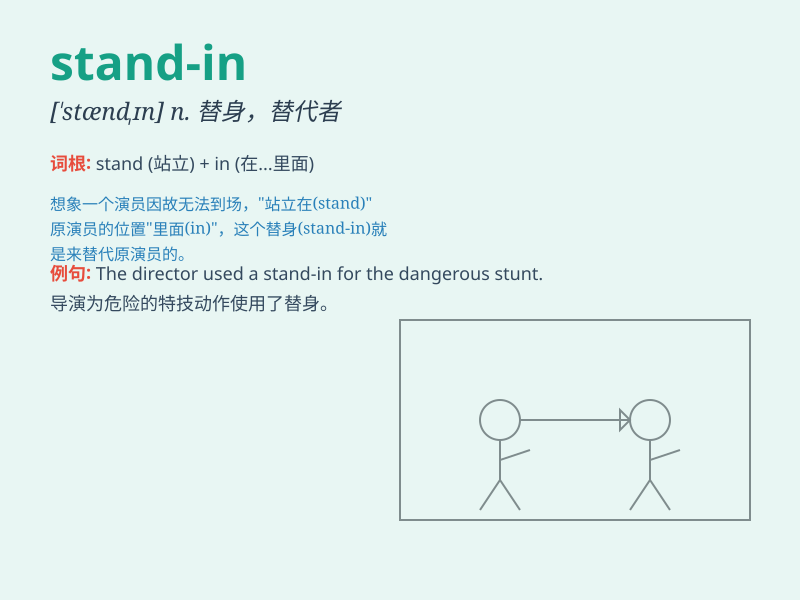

## stand-in

**英音:** _[stænd ɪn]_ **美音:** _[stænd ɪn]_

**译义:** *n. 替身演员；临时替代者*

### 短语

+ **stand-in for:** _代替；替身_

+ **a stand-in actor:** _替身演员_

+ **stand-in role:** _替身角色_

+ **find a stand-in:** _找一个替身_

+ **serve as a stand-in:** _充当替身_

### 例句

#### 例句1

> **The actor\'s stand-in performed the dangerous stunt.**

**中文翻译:** 这位演员的替身完成了这个危险的特技。

**单词释义:** 替身

#### 例句2

> **She was hired as a stand-in for the sick secretary.**

**中文翻译:** 她被雇来作为生病秘书的临时替代者。

**单词释义:** 临时替代者

#### 例句3

> **The stand-in filled in for the manager during the meeting.**

**中文翻译:** 在会议期间，这个临时人员代替了经理。

**单词释义:** 临时人员；代替者

### 背诵小故事

>
想象一下，一场电影拍摄中，主演突然生病，这时候有个和主演很像的人挺身而出，临时替代主演完成拍摄，这个人就是
stand-in，也就是替身。

**想象在电影拍摄中，主演生病时挺身而出临时替代主演的人就是【替身】**

### 图义

