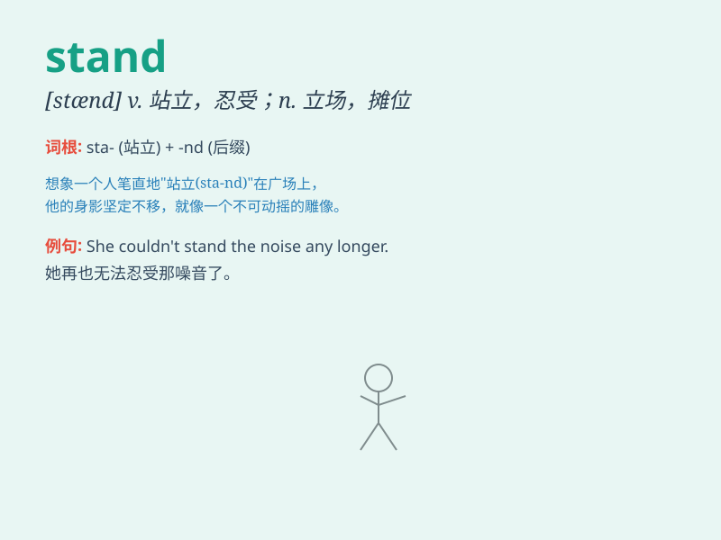

## stand

**英音:** _[stænd]_ **美音:** _[stænd]_

**译义:**
*n.停止,抵抗的状态,立场,立足点,看台,架子,台v.站,立,站起,(使)竖立,(使)位于,维持不变,持久,经受*

### 短语

+ **stand up:** _起立；站起来_

+ **stand for:** _代表；象征；支持_

+ **stand out:** _突出；显眼；杰出_

+ **stand in:** _代替；替身演员_

+ **stand by:** _支持；袖手旁观；准备_

### 例句

#### 例句1

> **I can\'t stand the noise anymore.**

**中文翻译:** 我再也忍受不了这噪音了。

**单词释义:** 忍受

#### 例句2

> **She stands by her decision.**

**中文翻译:** 她坚持她的决定。

**单词释义:** 坚持

#### 例句3

> **The building stands at the corner of the street.**

**中文翻译:** 那座大楼位于街道的拐角处。

**单词释义:** 位于

### 背诵小故事

> A boy was at the bus stop. The bus was late, but he had to stand and
wait. He was tired but still stood there patiently. Finally, the bus
came and he could go home.

**一个男孩在公交站。公交车晚点了，但他不得不站着等。他很累但仍耐心地站在那里。最后，公交车来了，他可以回家了。**

### 图义

