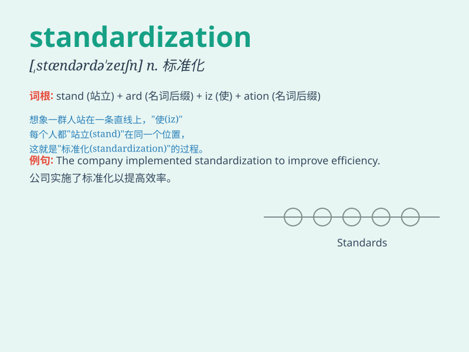

## standardization

**英音:** _[,stændədaɪ\'zeɪʃən]_ **美音:**
_[,stændədaɪ\'zeʃən]_

**译义:** *n.标准化*

### 短语

+ **quality standardization:** _质量标准化_

+ **process standardization:** _流程标准化_

+ **data standardization:** _数据标准化_

+ **industry standardization:** _行业标准化_

+ **product standardization:** _产品标准化_

### 例句

#### 例句1

> **The standardization of medical procedures is crucial for ensuring
patient safety.**

**中文翻译:** 医疗程序的标准化对于确保患者安全至关重要。

**单词释义:** 标准化

#### 例句2

> **The company is working towards the standardization of its
products across different markets.**

**中文翻译:** 该公司正在努力实现其产品在不同市场的标准化。

**单词释义:** 标准化

#### 例句3

> **Standardization helps to improve the quality and comparability of
data.**

**中文翻译:** 标准化有助于提高数据的质量和可比性。

**单词释义:** 标准化

### 背诵小故事

> A factory was in chaos until a wise manager came and implemented
standardization. He set clear rules and processes, making everything
from production to quality control uniform. This led to great success.
Standardization means making things conform to a standard.

**一家工厂曾一片混乱，直到一位明智的经理到来并实施了标准化。他制定了清晰的规则和流程，让从生产到质量控制的一切都变得统一。这带来了巨大的成功。standardization
意思是使事物符合标准。**

### 图义

