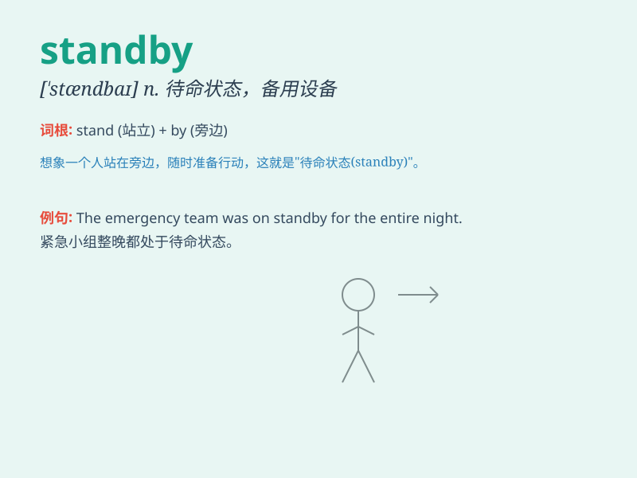

## standby

**英音:** _[\'stæn(d)baɪ]_ **美音:** _[\'stændbaɪ]_

**译义:** *n.可以信任的人,使船待命的信息 备用*

### 短语

+ **on standby:** _处于待命状态；随时准备_

+ **standby mode:** _待机模式；备用模式_

+ **standby power:** _备用电源；待机功率_

+ **standby ticket:** _候补票_

+ **standby crew:** _后备人员；待命机组_

### 例句

#### 例句1

> **The emergency services are on standby in case of any
problems.**

**中文翻译:** 紧急服务部门随时待命以防出现任何问题。

**单词释义:** 待命；准备就绪

#### 例句2

> **I always keep some money on standby for unexpected expenses.**

**中文翻译:** 我总是预留一些钱以备不时之需。

**单词释义:** 备用的；预备的

#### 例句3

> **The actor was on standby, waiting for his cue to go on stage.**

**中文翻译:** 这位演员在一旁候场，等待上台的提示。

**单词释义:** 等待（指示或时机）

### 背诵小故事

>
想象你在机场，航班延误了，你只能在候机区等待。工作人员告诉你要处于\'standby\'状态，随时准备登机。这就是\'standby\'，意思是等待、备用。

**想象在机场航班延误时处于等待备用状态来理解\'standby\'（等待、备用）这个单词**

### 图义

