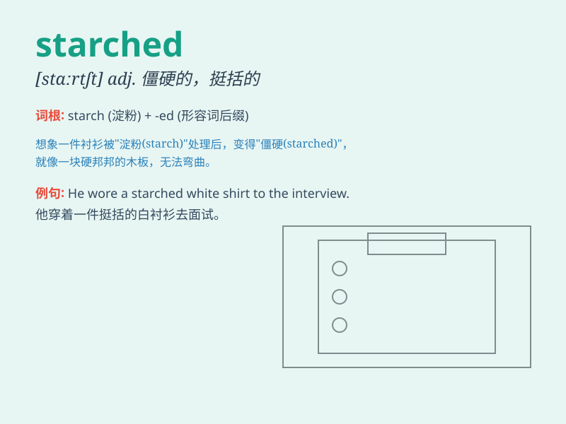

## starched

**英音:** _[stɑːtʃt]_ **美音:** _[stɑrtʃt]_

**译义:** *adj.浆硬的,硬挺的,拘泥刻板的*

### 短语

+ **starched collar:** _浆硬的衣领_

+ **starched shirt:** _浆过的衬衫_

+ **starched fabric:** _上浆的织物_

+ **starched napkin:** _浆过的餐巾_

+ **starched appearance:** _刻板的外表_

### 例句

#### 例句1

> **She wore a starched white shirt.**

**中文翻译:** 她穿着一件浆洗过的白衬衫。

**单词释义:** 浆洗过的

#### 例句2

> **The starched tablecloth looked very neat.**

**中文翻译:** 浆过的桌布看起来非常整洁。

**单词释义:** 浆过的

#### 例句3

> **His starched collar made him feel uncomfortable.**

**中文翻译:** 他那浆硬的衣领让他感觉不舒服。

**单词释义:** 浆硬的

### 背诵小故事

> A tailor was working hard to make shirts. He used a special powder to
make the fabric starched, making the shirts stiff and neat. Now you know
\'starched\' means made stiff and smooth with starch.

**一位裁缝正在努力工作制作衬衫。他使用一种特殊的粉末让布料变得硬挺，使衬衫变得笔挺整洁。现在你知道'starched'意思是用淀粉使其变硬和平整。**

### 图义

