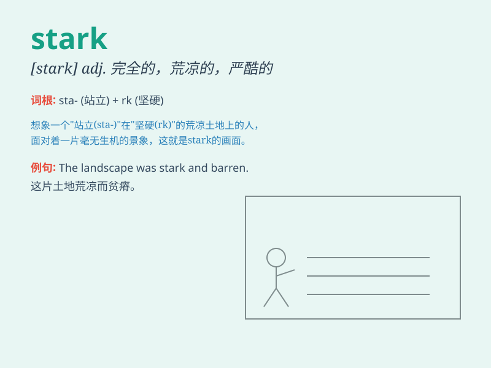

## stark

**英音:** _[stɑːk]_ **美音:** _[stɑrk]_

**译义:** *adj.刻板的,十足的,赤裸的,荒凉的adv.完全地*

### 短语

+ **stark naked:** _一丝不挂；赤条条_

+ **stark reality:** _严酷的现实_

+ **stark contrast:** _鲜明对比_

+ **stark choice:** _严峻的选择_

+ **stark raving mad:** _完全疯了_

### 例句

#### 例句1

> **The contrast between the rich and the poor in this city is
stark.**

**中文翻译:** 在这个城市，富人和穷人之间的对比是鲜明的。

**单词释义:** 鲜明的；突出的

#### 例句2

> **The room was stark and bare, with no furniture or decoration.**

**中文翻译:** 这个房间空无一物，没有家具也没有装饰。

**单词释义:** 空的；荒凉的

#### 例句3

> **He faced the stark reality of losing his job and having to start
over.**

**中文翻译:** 他面临着失去工作不得不重新开始的严酷现实。

**单词释义:** 严酷的；赤裸裸的

### 背诵小故事

> In a cold and desolate land, there was a stark castle standing alone.
It had no decoration or warmth, just bare walls and a stern look. This
scene made the meaning of \'stark\' - bare, plain and severe - very
clear.

**在一片寒冷荒凉的土地上，有一座光秃秃的城堡孤零零地矗立着。它没有任何装饰，也没有温暖，只有光秃秃的墙壁和严峻的外观。这个场景让"stark"------光秃的、朴素的、严峻的------这个意思变得非常清晰。**

### 图义

