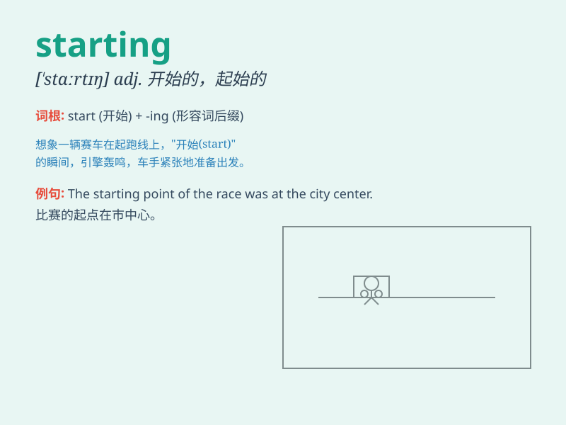

## starting

**英音:** _[ˈstɑːtɪŋ]_ **美音:** _[ˈstɑːrtɪŋ]_

**译义:** *n.出发,开始*

### 短语

+ **starting point:** _起点；出发点_

+ **starting salary:** _起薪_

+ **starting line:** _起跑线_

+ **starting time:** _开始时间_

+ **starting position:** _起始位置_

### 例句

#### 例句1

> **I\'m starting to feel tired.**

**中文翻译:** 我开始感到累了。

**单词释义:** 开始

#### 例句2

> **The race is starting soon.**

**中文翻译:** 比赛很快就要开始了。

**单词释义:** 开始

#### 例句3

> **She is starting a new business.**

**中文翻译:** 她正在开办一家新企业。

**单词释义:** 开办；启动

### 背诵小故事

> A brave athlete was standing at the starting line, ready to begin the
race. The starting whistle blew, and he took off with all his strength.
Remember, \'starting\' is where it all begins!

**一位勇敢的运动员站在起跑线处，准备开始比赛。起跑的哨声吹响，他用尽全力出发。记住，'starting'就是开始的地方！**

### 图义

