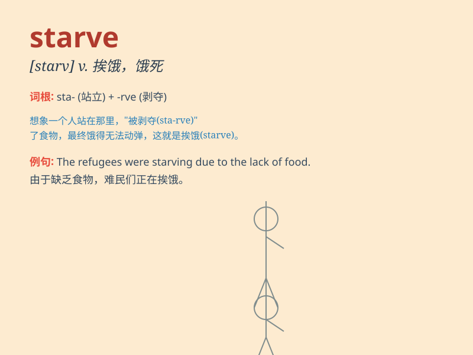

## starve

**英音:** _[stɑːv]_ **美音:** _[stɑrv]_

**译义:** *vt.使饿死vi.饿得要死*

### 短语

+ **starve to death:** _饿死_

+ **starve for:** _渴望；急需_

+ **be starved of:** _缺乏；急需_

+ **starve out:** _（以饥饿迫使）投降；断粮迫使（某人）出来_

+ **starve someone into doing something:**
_使某人挨饿以迫使做某事_

### 例句

#### 例句1

> **The homeless man was starving on the street.**

**中文翻译:** 这个无家可归的人在街上挨饿。

**单词释义:** 挨饿

#### 例句2

> **The plants are starving for water.**

**中文翻译:** 这些植物缺水快要死了。

**单词释义:** （因缺乏...）挨饿；饿死；极度匮乏

#### 例句3

> **If you don\'t eat on time, you\'ll starve.**

**中文翻译:** 如果你不按时吃饭，你会挨饿的。

**单词释义:** 挨饿；饿死

### 背诵小故事

> A poor man was lost in a forest. He had no food and was starving. He
kept walking, hoping to find something to eat. Finally, he was rescued
before he completely collapsed.

**一个可怜的人在森林里迷路了。他没有食物，正在挨饿。他不停地走，希望能找到吃的东西。最后，在他完全倒下之前，他获救了。**

### 图义

