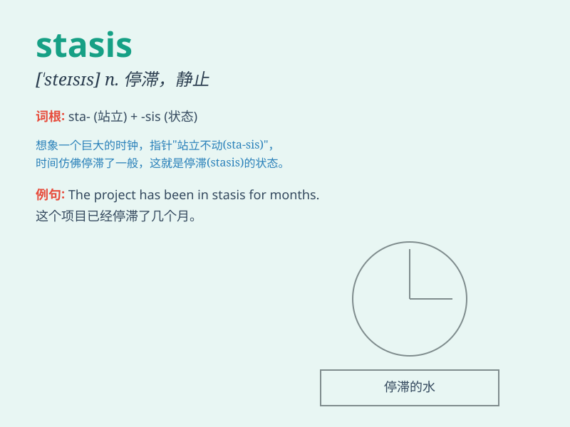

## stasis

**英音:** _[\'steɪsɪs; \'stæ-]_ **美音:** _[\'stesɪs]_

**译义:** *n.停滞,郁积*

### 短语

+ **cardiac stasis:** _心脏停滞_

+ **venous stasis:** _静脉停滞_

+ **blood stasis:** _血瘀_

+ **urinary stasis:** _尿潴留_

+ **intestinal stasis:** _肠停滞_

### 例句

#### 例句1

> **The country has been in a state of stasis for several years.**

**中文翻译:** 这个国家已经处于停滞状态好几年了。

**单词释义:** 停滞；静止

#### 例句2

> **There is a stasis in the economy that needs to be addressed.**

**中文翻译:** 经济存在停滞的情况，这需要得到解决。

**单词释义:** 停滞；静止

#### 例句3

> **The stasis of the project was due to lack of funds.**

**中文翻译:** 这个项目的停滞是由于缺乏资金。

**单词释义:** 停滞；静止

### 背诵小故事

>
想象一个古老的城堡，里面的时间仿佛停止了，一切都处于静止不动的状态，这种静止的状态就是\'stasis\'。就像被施了魔法，没有任何变化和动态，完全的停滞。

**想象古老城堡中时间停滞的情景来记住\'stasis\'这个表示静止、停滞的单词**

### 图义

