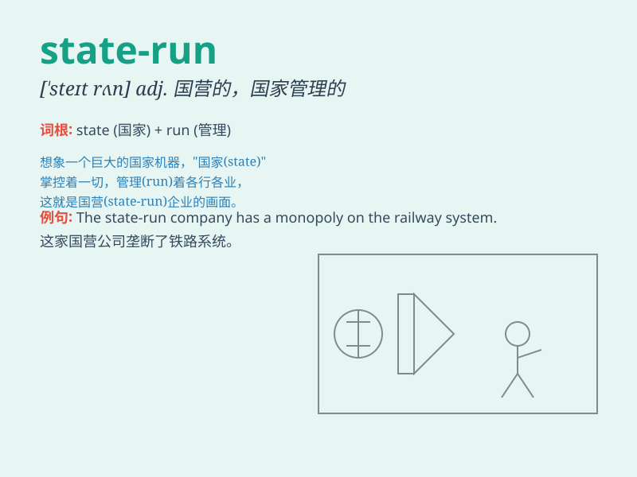

## state-run

**英音:** _[steɪtˈrʌn]_ **美音:** _[steɪtˈrʌn]_

**译义:** *由国家经营的；国营的*

### 短语

+ **state-run enterprise:** _国营企业_

+ **state-run hospital:** _公立医院_

+ **state-run school:** _公立学校_

+ **state-run media:** _国有媒体_

+ **state-run institution:** _国家机构_

### 例句

#### 例句1

> **The state-run hospital provides excellent medical services.**

**中文翻译:** 这家国营医院提供出色的医疗服务。

**单词释义:** 国营的

#### 例句2

> **Many state-run enterprises have undergone significant reforms in
recent years.**

**中文翻译:** 近年来，许多国有企业经历了重大改革。

**单词释义:** 国营的；国有的

#### 例句3

> **The state-run media plays an important role in informing the
public.**

**中文翻译:** 国营媒体在向公众提供信息方面发挥着重要作用。

**单词释义:** 国营的

### 背诵小故事

> Imagine a big country. The government decides to manage all the
hospitals directly. These hospitals are called state-run. It means they
are operated and controlled by the state.

**想象一个大国。政府决定直接管理所有的医院。这些医院被称为国营的。这意味着它们是由国家经营和控制的。**

### 图义

