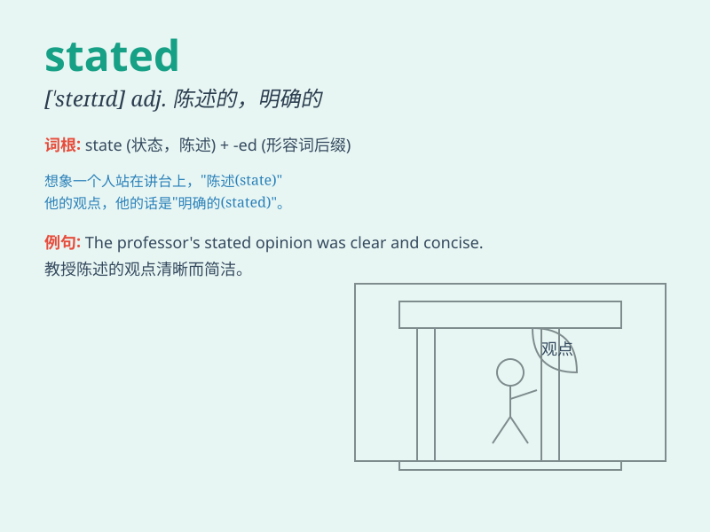

## stated

**英音:** _[\'steɪtɪd]_ **美音:** _[\'stetɪd]_

**译义:** *adj.定期的,规定的,一定的*

### 短语

+ **stated price:** _标明价格_

+ **stated purpose:** _既定目的_

+ **stated income:** _申报收入_

+ **stated intention:** _公开表明的意图_

+ **stated case:** _陈述的情况_

### 例句

#### 例句1

> **The stated goal of the project is to increase efficiency by
50%.**

**中文翻译:** 这个项目明确陈述的目标是将效率提高 50%。

**单词释义:** 明确陈述的

#### 例句2

> **He adhered to the stated rules without question.**

**中文翻译:** 他毫无疑问地遵守了所述的规则。

**单词释义:** 所述的

#### 例句3

> **The stated time for the meeting is 3 p.m.**

**中文翻译:** 会议规定的时间是下午 3 点。

**单词释义:** 规定的

### 背诵小故事

> A king stated his intention to build a grand castle. Everyone was
amazed by his clearly expressed plan. The word \'stated\' here means to
express or say something clearly and definitely.

**一位国王陈述了他建造一座宏伟城堡的意图。每个人都对他清晰表达的计划感到惊讶。单词'stated'在这里的意思是清晰明确地表达或说出某事。**

### 图义

